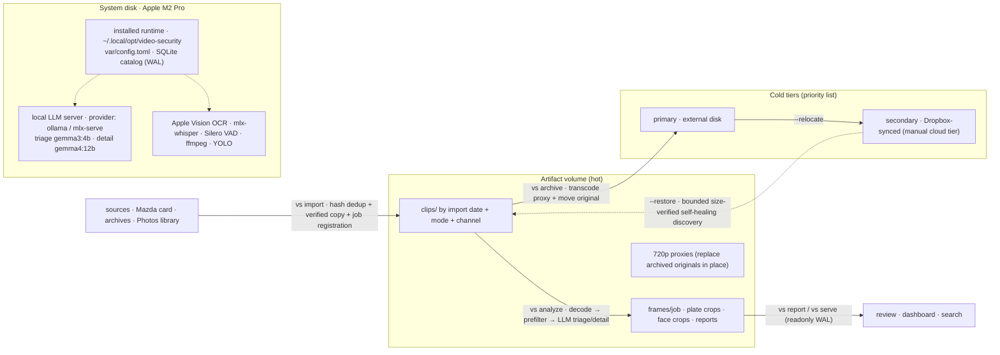

# Video Security Analyzer — Design Document

## Overview

A local, resumable CLI tool that analyzes security camera footage overnight using
a cheap-first pipeline architecture. Frames are extracted with scene-aware dedup,
prefiltered through fast CV detectors, then suspicious events are escalated to a
local vision LLM for detailed analysis. All processing runs offline on Apple Silicon.

**Hardware**: Apple M2 Pro, 16 GB unified memory, 10-core CPU.

**Models**: triage gemma3:4b / detail gemma4:12b via Ollama, or the mlx_serve
primaries — `mlx-community/gemma-4-e4b-it-4bit` (triage),
`mlx-community/gemma-4-12b-it-4bit` (detail), and
`mlx-community/Qwen3-Embedding-0.6B-4bit-DWQ` (embeddings). mlx_serve is the
primary backend; `[llm] provider` selects it or "ollama" at config load, so
switching is a one-line rollback. gemma4:12b vision capability must be verified
before implementation.

**Key design constraint**: only 39 GB free on system disk. All artifacts
(keyframes, crops, reports) go to an optional external volume. System disk is
reserved for code, models, and OS.

---

## Architecture

```
Source Video
    │
    ├── frames ──→ single decode pass (motion + dHash + MOG2 blob gate)
    │                  │
    │           keep if: motion OR heartbeat(30s) OR scene change
    │           OSD mask applied before diffing/hashing
    │           CLAHE normalization on low-luminance frames
    │                  │
    ├── audio ────→ Whisper (MLX) → transcript
    │           condition_on_previous_text=False
    │           Silero VAD 300ms padding
    │           pin language if monolingual deployment
    │           piped directly from ffmpeg → no temp WAV on disk
    │
    └──→ Prefilter (shared decode pass, 3 consumers)
          │
          ├── Vehicle pipeline:
  │   YOLO CoreML (batch 8-16, relevant classes only: person, car,
  │   truck, bus, motorcycle, bicycle, dog, cat) → ByteTrack (ultralytics built-in,
          │   no separate dep) → per-track: plate crop → upscale 2-4× → Vision
          │   OCR → consensus vote across all frames of the track → plates table
          │
          ├── Threat pipeline:
          │   person + motion intensity + time-of-day weight → anomaly score
          │   → adjacent flags merged deterministically → events table
          │
          └── Scene text pipeline:
              Vision OCR 1-per-30s sample → frame_text table + FTS5 index

    ▼
Prefilter output: events table with event_type + keyframes_json + priority

    ▼
LLM Triage (Pass 1): single keyframe per event, tight prompt, ~60-100 tokens,
    ~6-8s per event. gemma3:4b. Top-N only (--max-llm-events breaker).

    ▼
LLM Detail (Pass 2): multi-keyframe, only events escalated from Pass 1.
    gemma4:12b. ~20-40s per event. Stores model_digest + prompt_version per row.

    ▼
Reports: timeline + plates catalog + events log + transcript export
```

### System layout & data flow


```mermaid
flowchart LR
    subgraph SYS["System disk · Apple M2 Pro"]
        RT["installed runtime · ~/.local/opt/video-security<br>var/config.toml · SQLite catalog (WAL)"]
        LLM["local LLM server · provider: ollama / mlx-serve<br>triage gemma3:4b · detail gemma4:12b"]
        LOCAL["Apple Vision OCR · mlx-whisper · Silero VAD · ffmpeg · YOLO"]
    end

    subgraph HOTV["Artifact volume (hot)"]
        CLIPS["clips/ by import date + mode + channel"]
        EV["frames/job · plate crops · face crops · reports"]
        PROXY["720p proxies (replace archived originals in place)"]
    end

    subgraph COLD["Cold tiers (priority list)"]
        C1["primary · external disk"]
        C2["secondary · Dropbox-synced (manual cloud tier)"]
    end

    SRC["sources · Mazda card · archives · Photos library"] -->|"vs import · hash dedup + verified copy + job registration"| CLIPS
    CLIPS -->|"vs analyze · decode → prefilter → LLM triage/detail"| EV
    RT -.-> LLM & LOCAL
    CLIPS -->|"vs archive · transcode proxy + move original"| C1
    C1 -->|"--relocate"| C2
    C2 -.->|"--restore · bounded size-verified self-healing discovery"| CLIPS
    EV -->|"vs report / vs serve (readonly WAL)"| USER["review · dashboard · search"]
```

---

## Modules

### Module 1: Frame + Audio Ingest

**Frame extraction**
- ffmpeg single decode pass computing: motion score + dHash + MOG2 blob gate
- Keep frame if: motion above threshold OR heartbeat (every 30s) OR scene change
- OSD mask applied before diffing/hashing — burned-in timestamps defeat pixel-diff
- CLAHE normalization on low-luminance frames (night/IR footage)
- Frames are **streamed, never persisted to disk** — only event keyframes survive

**Audio extraction**
- ffmpeg pipe PCM directly into mlx-whisper — no temp WAV file on disk
- `condition_on_previous_text=False` to prevent hallucination loops on noise
- Silero VAD with 300ms padding (prevents speech-onset clipping)
- Pin language if deployment is monolingual (auto-detect can flip on noisy audio)
- Single Whisper stack: mlx-whisper only. Model: small (~0.5 GB) or large-v3-turbo (~1.6 GB)

**Audio event detection** (cheap, deterministic, runs during ingest):
- RMS energy analysis on the PCM stream — sustained energy above baseline flags
  shouting/glass-break/car-alarm candidates (no ML needed)
- Keyword matching on transcript segments — distress words ("help", "police",
  "get out") create `audio_distress` event candidates
- Both feed the events table with `clip_id`, no track_id, no keyframes (LLM gets
  transcript text only, no frames)

### Module 2: Fast Prefilter

Three consumers fed by shared decode pass. Runs serially (not concurrently).

**Vehicle pipeline**
- YOLOv8 CoreML (.mlpackage) for ANE acceleration. Batch 8-16.
- Relevant classes only: person, car, truck, bus, motorcycle, bicycle,
  dog, cat
- ByteTrack via ultralytics built-in (`model.track(tracker="bytetrack.yaml")`)
- Per-track plate pipeline: vehicle crop → upscale 2-4× → Vision OCR
  (`VNRecognizeTextRequest` via pyobjc-framework-Vision) → per-track consensus
  vote across all frames → best text + confidence → plates table
- Weapon is NOT a detector class. If LLM describes one, it goes in report as
  "described object, unverified" — never emitted as a machine-generated label.

**Threat pipeline**
- Person detection + motion intensity + time-of-day weight → anomaly score
- Adjacent flagged frames merged deterministically into events (SQL/Python, not LLM)
- Events written to events table with closed event type enum defined by source adapter

**Scene text pipeline**
- Vision OCR 1 sample per 30s on full frame for signage, timestamps, billboards
- Stored in frame_text table with FTS5 index

### Module 3: Slow LLM Analysis

**Audio context injection**: each event sent to the LLM includes the transcript
window ±30s around the event time range (from transcript_segments), wrapped in
delimiters as untrusted input. Prompt template:

```json
{
  "frames": ["<keyframe 1>", "<keyframe 2>"],
  "transcript_window": "[00:01:15] hello?\n[00:01:22] who's there? I'm calling police",
  "metadata": {"event_type": "intrusion", "detector_score": 0.83}
}
```

Two-pass system:

**Pass 1 (Triage)**: single keyframe per event. Tight prompt. ~60-100 tokens output.
Gemma3:4b. ~6-8s per event. Only top-N events by score.

**Pass 2 (Detail)**: multi-keyframe. Only events escalated from Pass 1.
Gemma4:12b. ~20-40s per event. Escalation ladder: whole event → tile (10-20%
overlap mandatory) → merge/dedup. No temperature-boost retry.

Per-row storage: model_digest (provider model id; Ollama `ollama show` or the
mlx_serve model name), prompt_version, raw_response (for
re-parseability without re-inference).

### Module 4: Batch Engine

- SQLite state machine: `pending → extracting → filtering → triage → detail → done | failed`
- Content-hash identity on video-level only (no per-frame SHA-256)
- Lease-based recovery for crash safety
- Hard stage serialization enforced — no concurrent heavy stages
- Disk preflight: refuse start if <10 GB free
- Disk runtime watermark: checkpoint + abort if free drops below 5 GB
- Signal handling: first SIGTERM finishes current work + commits; second forces quit
- `--stop-after` time budgets (compound duration parsing: `2h`, `90m`, `45s`)
- `caffeinate -s -i` wrapper — prevent sleep during batch. AC-only (check before asserting)
- Poison-message handling: corrupt clips get max-attempts → dead-letter
- Corrupt/truncated clip policy: catch ffmpeg decode errors, mark clip failed, continue job
- Power: mains-powered required. Document.

### Module 5: Alert & Report

- Timeline report with events + transcript aligned
- Plate catalog FTS5 searchable. Use trigram tokenizer or indexed LIKE for partial
  plate search (default unicode61 splits "ABC-123" into 2 tokens, fails "BC123")
- Driving log with weaving/near-miss events
- Transcript + events export
- HTML reports ~50 MB/night maximum
- No per-frame contact sheets — only event keyframes

---

## Data Model

```sql
-- Core job tracking (content-addressed on video, not frame)
jobs(
    id INTEGER PRIMARY KEY,
    video_path TEXT NOT NULL,
    video_hash TEXT NOT NULL,
    status TEXT NOT NULL DEFAULT 'pending',  -- pending|extracting|filtering|triage|detail|done|failed
    total_frames INTEGER,
    current_frame INTEGER DEFAULT 0,
    current_stage TEXT DEFAULT 'pending',
    recording_start_utc TEXT,
    import_id TEXT,                  -- card import batch identifier
    created_at TIMESTAMP DEFAULT CURRENT_TIMESTAMP,
    updated_at TIMESTAMP DEFAULT CURRENT_TIMESTAMP
);

-- Kept frames only — static frames are dropped during dedup
frames(
    job_id INTEGER NOT NULL,
    clip_id INTEGER NOT NULL,
    frame_number INTEGER NOT NULL,
    timestamp_sec REAL NOT NULL,
    dhash INTEGER,
    lighting_condition TEXT,  -- day|dusk|night|ir
    PRIMARY KEY (job_id, clip_id, frame_number)
);

-- Closed event taxonomy, defined by source adapter
events(
    id INTEGER PRIMARY KEY,
    job_id INTEGER NOT NULL,
    event_type TEXT NOT NULL,
    start_sec REAL NOT NULL,
    end_sec REAL NOT NULL,
    clip_id INTEGER NOT NULL,
    track_id INTEGER,               -- NULL for multi-track, audio, or non-vehicle events
    keyframes_json TEXT DEFAULT '[]',  -- empty for audio-only events
    detector_score REAL NOT NULL,
    priority REAL NOT NULL DEFAULT 0.5,
    status TEXT NOT NULL DEFAULT 'pending',  -- pending|triaged|detailed|resolved|suppressed
    llm_result_id INTEGER
);

-- Vehicle tracks for plate consensus and trajectory analysis
vehicle_tracks(
    job_id INTEGER NOT NULL,
    track_id INTEGER NOT NULL,
    clip_id INTEGER NOT NULL,
    first_frame INTEGER NOT NULL,
    last_frame INTEGER NOT NULL,
    weaving_score REAL,
    direction TEXT,          -- N/S/E/W or wrong_way
    PRIMARY KEY (job_id, track_id, clip_id)
);

-- Per-track plate consensus
plates(
    job_id INTEGER NOT NULL,
    track_id INTEGER NOT NULL,
    clip_id INTEGER NOT NULL,
    raw_text TEXT,
    norm_text TEXT,                -- uppercase, alnum-only for search
    confidence REAL,
    best_frame INTEGER,
    ocr_votes_json TEXT,          -- all individual OCR reads across track frames
    PRIMARY KEY (job_id, track_id, clip_id)
);

-- Scene text capture (1-per-30s samples)
frame_text(
    id INTEGER PRIMARY KEY,
    job_id INTEGER NOT NULL,
    clip_id INTEGER NOT NULL,
    frame_number INTEGER NOT NULL,
    text TEXT NOT NULL,
    text_kind TEXT NOT NULL,       -- signage|timestamp|billboard|other
    region_json TEXT,
    confidence REAL NOT NULL
);
CREATE VIRTUAL TABLE frame_text_fts USING fts5(text, content=frame_text, content_rowid=id);

-- Audio transcript
transcript_segments(
    job_id INTEGER NOT NULL,
    clip_id INTEGER NOT NULL,
    segment_id INTEGER NOT NULL,
    start_time REAL NOT NULL,
    end_time REAL NOT NULL,
    text TEXT NOT NULL,
    language TEXT,
    PRIMARY KEY (job_id, clip_id, segment_id)
);

-- LLM analysis results (per-event, not per-frame)
analysis_results(
    id INTEGER PRIMARY KEY,
    job_id INTEGER NOT NULL,
    event_id INTEGER NOT NULL,
    model_digest TEXT NOT NULL,     -- provider model id (ollama show output or mlx_serve model name)
    prompt_version TEXT NOT NULL,
    analysis_type TEXT NOT NULL,     -- triage|detail|tiled|ocr_fallback
    raw_response TEXT NOT NULL,      -- original LLM JSON output
    confidence REAL,
    retry_count INTEGER DEFAULT 0,
    tiled_results TEXT,
    created_at TIMESTAMP DEFAULT CURRENT_TIMESTAMP
);

-- Per-camera configuration
cameras(
    id INTEGER PRIMARY KEY,
    name TEXT NOT NULL,
    source_pattern TEXT NOT NULL,     -- glob for source adapter to match
    config_json TEXT NOT NULL        -- homography, OSD mask, timezone, after-hours window, thresholds
);

-- Clip metadata (for multi-file sessions)
clips(
    job_id INTEGER NOT NULL,
    clip_id INTEGER NOT NULL,
    filename TEXT NOT NULL,
    channel TEXT NOT NULL DEFAULT 'front',
    priority REAL NOT NULL DEFAULT 0.5,
    recording_start_utc TEXT,
    duration_sec REAL,
    lighting TEXT DEFAULT 'day',
    has_audio BOOLEAN DEFAULT TRUE,
    PRIMARY KEY (job_id, clip_id)
);

-- GPS + G-sensor sidecar data (NMEA: $GPRMC position, $GSENS acceleration)
clip_gps_data(
    job_id INTEGER NOT NULL,
    clip_id INTEGER NOT NULL,
    time_sec REAL NOT NULL,  -- seconds relative to clip start
    lat REAL,
    lon REAL,
    speed_kmh REAL,
    bearing REAL,
    ax REAL,                 -- G-sensor lateral (g)
    ay REAL,                 -- G-sensor longitudinal (g), braking/accel
    az REAL,                 -- G-sensor vertical (g), impact/bumps
    PRIMARY KEY (job_id, clip_id, time_sec)
);

-- Session grouping (multi-file sessions)
sessions(
    job_id INTEGER NOT NULL,
    session_id TEXT NOT NULL,
    clips_json TEXT NOT NULL
);
```

**Indexes**: `(job_id, frame_number)` on `frames` and `frame_text`.

**SQLite discipline**: WAL mode, `busy_timeout`, single-writer via `BEGIN IMMEDIATE`. Checkpoint on clean shutdown.

---

## Dependencies

| Package | Purpose | Disk |
|---|---|---|
| ffmpeg | Frame + audio extraction | System |
| opencv-python | Motion, dHash, CLAHE, MOG2 | ~50 MB |
| ultralytics | YOLO + ByteTrack | ~2.5 GB (includes torch) |
| Pillow | Image encode/decode | ~10 MB |
| typer | CLI framework | ~5 MB |
| faster-whisper | Transcription engine | ~100 MB |
| silero-vad | VAD gate | ~10 MB |
| mlx-whisper | AS GPU transcription | ~20 MB |
| pyobjc-framework-Vision | Vision OCR + face | System |

**Total dep install**: ~3 GB.

**Removed from plan**: paddleocr (~1 GB saved), separate bytetrack, openai-whisper.

**Web console (Phase 3)**: was stdlib-only; since the 2026-09-27
FastAPI swap (Web Console → Serving), `fastapi` + `uvicorn` are runtime
deps. Node + npm are dev-only requirements for building the committed
React bundle.

---

## Hardware Constraints

- Apple M2 Pro, 16 GB unified memory, 10-core CPU
- 39 GB free system disk (96% full)
- Single machine, no distributed setup
- Ollama models already installed: gemma4:12b (7.6 GB), gemma3:4b (3.3 GB);
  mlx_serve (primary backend) serves
  `mlx-community/gemma-4-e4b-it-4bit` + `mlx-community/gemma-4-12b-it-4bit`
  with `--kv-quant 8`
- qwen3:14b and qwen2.5-coder should be deleted (~10.3 GB reclaimed)
- Secondary disk strongly recommended for artifacts

## Mandatory Rules

1. **Sleep prevention**: `caffeinate -s -i` wrapper. AC-only.
2. **Hard stage serialization**: never run two heavy stages concurrently.
   **Single-model residency**: at most one LLM model in memory at a
   time — the client evicts the previous model before generating with a
   different one (triage 4b → detail 12b swaps, never both resident;
   ~10 GB combined was contributing to memory-pressure kills on 16 GB).
   Ollama: `keep_alive: "30m"` sliding window keeps the active model warm
   between sparse calls during a run; explicit unload of all used models
   when the run ends (clean exit, Ctrl+C, or time budget) so nothing stays
   resident after the tool exits. mlx_serve: single-model residency via
   `--idle-evict-secs` on the server (`/v1/unload-model` from the client).
   `num_ctx` capped: 2048 triage, 4096-8192 detail.
3. **Disk preflight** ≥10 GB free + **runtime watermark** ≥5 GB.
   Frames never persisted to disk (streamed in memory). Only event keyframes
   (~3/event, JPEG q80, max width 1280px) + plate crops hit disk.
4. **Vision OCR** for plates and scene text. Apple Vision OCR preferred
   (`VNRecognizeTextRequest` via pyobjc-framework-Vision). PaddleOCR only as
   optional fallback if Vision underperforms on plates.
5. **Single Whisper stack**: mlx-whisper only. Model: small (~0.5 GB) or
   large-v3-turbo (~1.6 GB).
6. **gemma4:12b vision capability must be verified** before implementation.
   If text-only, fall back to Qwen2.5-VL-7B (~5-6 GB pull).

---

## Configuration

`~/.video-security/config.toml` (override with `--config <path>`). All magic
numbers live here — no hardcoded paths or thresholds in code.

**Precedence**: CLI flags > per-camera `cameras.config_json` > `config.toml`
> built-in defaults.

```toml
[storage]
db_path = "~/.video-security/db"                  # SQLite (internal, fast)
artifact_dir = "/Volumes/lacie8/video/vs"    # persistent artifacts (external)
staging_dir = null                                # optional local in-transit dir, cleaned per job

[import]
card_mount = "/Volumes/CX-8"                      # live card source
archive_dirs = ["/Volumes/lacie8/video/CX-8"]  # archived card copies
preflight_gb = 25                                 # artifact_dir free space required

[adapter.mazda_cx8]
timezone = "Asia/Tokyo"                           # camera clock tz (filename → UTC)

[adapter.mazda_cx8.priority]                      # mode → clip priority
EVENT = 1.0
PARKING = 0.8
MANUAL = 0.7
NORMAL = 0.3

[adapter.mazda_cx8.gsens]                         # G-sensor thresholds (g, deviation from baseline)
hard_brake_g = 0.35                               # |ay| longitudinal (braking/accel)
hard_corner_g = 0.30                              # |ax| lateral
impact_g = 0.80                                   # spike, any axis (az baseline ≈ -1.0 gravity)

[engine]
heartbeat_sec = 30                                # dedup keep-floor
max_llm_events = 100                              # LLM budget circuit breaker
retention_days = 30                               # prune disk + DB rows older than N days
disk_preflight_gb = 10                            # system disk: refuse start below
disk_watermark_gb = 5                             # system disk: checkpoint + abort below

[llm]
provider = "mlx-serve"                              # mlx-serve (primary) | ollama
# ollama_url = "http://localhost:11434"
# mlx_url = "http://127.0.0.1:11234"
# Per-provider model overrides: [llm.triage.models] "mlx-serve" = "mlx-community/gemma-4-e4b-it-4bit"

[llm.triage]
model = "gemma3:4b"
num_ctx = 2048
timeout_s = 120

[llm.detail]
model = "gemma4:12b"
num_ctx = 8192
timeout_s = 300

[whisper]
model = "small"                                   # small | large-v3-turbo
language = null                                   # pin (e.g. "ja") if monolingual

[prefilter]
scene_text_sample_sec = 30                        # Vision OCR sampling interval
motion_threshold = 0.05                            # mean abs diff, keep-gate (camera overrides)
scene_change_hash_dist = 12                       # dHash hamming distance for scene change
night_luma = 60                                    # mean luma below → night lighting
ir_max_sat = 20                                    # max saturation for ir classification (0-255)
decode_width = 1280                                # working decode resolution (motion path runs at 480p)
yolo_model = "yolov8n"                             # ultralytics weights (or CoreML path below)
yolo_conf = 0.25                                    # YOLO confidence threshold
yolo_coreml_path = null                             # pre-exported .mlpackage for ANE (optional)
ocr_min_conf = 0.3                                  # Vision OCR read confidence floor
plate_min_votes = 2                                 # consensus votes required for a plate
plate_crop_pad = [0.5, 0.6, 0.25, 0.2]              # plate crop multipliers (left/up/down/right of bbox dims)

[threat]
score_threshold = 0.5                               # anomaly score to flag a frame
person_weight = 0.4                                 # person presence weight
motion_weight = 0.3                                 # motion intensity weight
time_weight = 0.3                                    # after-hours/night boost
after_hours = ["22:00-06:00"]                       # local-time windows (camera overrides)
loiter_min_sec = 60                                  # duration for loitering classification
merge_gap_sec = 5                                   # gap that still merges adjacent flags
min_person_frames = 8                                # person-track frames required before events (flicker gate)
person_conf_floor = 0.0                              # best-person conf to count toward persistence (0 = off)

[threat.priority]                                   # event type → priority
intrusion = 0.9
loitering = 0.6
suspicious_behavior = 0.5

[report]
reverse_geocode = true                              # OSM Nominatim, cached in gps_reverse_geocode

[map]
carto_api_key = null                                # optional CARTO basemap key — local config only, never committed

[web]
host = "127.0.0.1"                                  # vs serve binding (loopback only)
port = 8377

[repair]
untrunc_path = null                                 # absolute untrunc path; default: PATH, then ~/.local/bin/untrunc

[audio]
rms_window_ms = 100                                # RMS analysis window
rms_sustain_ms = 500                               # min sustained duration for loud events
rms_factor = 4.0                                    # loud = RMS > baseline * factor
rms_floor = 0.02                                    # absolute loud threshold (silence guard)
vad_pad_ms = 300                                    # Silero VAD padding (speech onset)
distress_keywords = ["help", "police", "get out"]   # audio_distress keyword triggers
```

**Per-camera overrides** (`cameras.config_json` in DB — wins over TOML for that
camera's footage):

```json
{
  "osd_mask": [[x1,y1,x2,y2]],
  "after_hours": ["22:00-06:00"],
  "motion_threshold": 0.05,
  "yolo_classes": [0, 1, 2, 3, 4, 5, 6],
  "homography": null
}
```

**Streaming minimizes local-disk need**: no temp WAV (ffmpeg pipes PCM to
whisper), frames never persisted (only event keyframes + plate crops hit
`artifact_dir`). `staging_dir` is an escape hatch for in-transit files only if
a measurable bottleneck appears — cleaned after every job.

**Mid-job external-drive loss**: I/O errors caught, job checkpoints, aborts
cleanly. `--resume` after remount.

---

## Model Strategy

- **Provider selection**: `[llm] provider = "mlx-serve"` (primary) or `"ollama"`;
  `make_llm_client(cfg)` factory validates at load. Per-provider stage model
  maps (`[llm.triage.models]`, `[llm.detail.models]`, `[llm.embed.models]`)
  resolve the active provider's model at config load.
- Lazy fetching — don't pull models at install. Config specifies per-stage models.
  Startup verifies presence, warns if missing. User pre-pulls.
- Installed: Ollama gemma4:12b (detail pass), gemma3:4b (triage pass);
  mlx_serve `mlx-community/gemma-4-e4b-it-4bit` (triage),
  `mlx-community/gemma-4-12b-it-4bit` (detail),
  `mlx-community/Qwen3-Embedding-0.6B-4bit-DWQ` (embeddings)
- `--only-llm` for re-running analysis with different models on existing prefilter
  output — prompt iteration without re-processing video
- Model digest (provider model id; `ollama show` under Ollama, the mlx_serve
  model name under mlx_serve) + prompt_version stored per analysis_result row
- Single-model residency: one model resident at a time; the client
   evicts the previous model on swap, keeps the active model warm via a 30m
   sliding `keep_alive` (Ollama) or server-side `--idle-evict-secs` (mlx_serve),
   and unloads everything when the run ends

---

## Scene Description Strategy

LLM never runs per frame. Descriptions are three-tier, cheapest that works:

1. **LLM detail pass** — prose descriptions for events that survive triage;
   one `analysis_results` row per pass (~1-2 KB). This is the only stored
   prose; per-frame LLM would cost hours per clip and GBs of storage.
2. **Deterministic synthesis** — at report time, events without LLM text
   get a scene description assembled from structured data (driving/
   parking/stationary category from clip mode + GPS speed, speed, G-force,
   face counts, plates, coordinates). Nothing stored; recomputed on render.
3. **Event category** — derived at render time from the clip's dashcam
   mode (path segment, e.g. PARKING) and GPS speed at event time
   (driving ≥ 5 km/h, else stationary; unknown without GPS). Feeds both
   the synthesis and future web-ui filters.

## Theming (Person of Interest design language)

Reports and the future web UI share one visual language, adapted from
two MIT-licensed references — poi-web-ui (Krisztián Kis, Phresh-IT) and
positronick-ui (Nicholas Sollazzo) — rewritten as framework-free modern
CSS custom properties in `report_theme.py`.

- **Two polarities**, one token layer, switched by `data-theme` on the
  root element:
  - **Machine** (dark, default): black surface, white ink, neon-red
    accent `#ff0000` with glow emphasis, graph-paper-free flat black,
    subtle scanlines, pulsing REC dot.
  - **Samaritan** (light): white surface, black ink, crisp red
    `#e8000d` without glow; strictly monochrome (info/success collapse
    to ink, warning to accent). Hairline frame edges + center reticle
    instead of glowing corner brackets.
- **Type**: Barlow Semi Condensed (display, uppercase, 0.08em
  tracking) + JetBrains Mono (data) via Google Fonts with system
  fallbacks.
- **Geometry**: 0px radius, hairline borders, monospace data rows.
- **Subject frames**: keyframes framed as targets — corner brackets
  tinted by event tone (threat red, warning amber, info blue, asset
  white) with a designation tag straddling the top edge.
- **Accessibility**: `prefers-reduced-motion` disables the pulse;
  print stylesheet flattens to black-on-white and hides the toggle.
- The static report embeds the CSS + a tiny vanilla-JS toggle
  (localStorage persistence, no-FOUC restore). The future web UI
  reuses the same `--vs-*` tokens.

## CLI

```
Global flags: --config <path>, --db <path>          override config file / DB location

vs-import <card-mount>           copy new clips off card to artifact disk, dedup by hash
vs-analyze <video>               full pipeline
vs-analyze <video> --no-llm      prefilter + OCR + tracking only (no LLM)
vs-analyze --only-llm            re-run LLM on existing prefilter output
vs-analyze --resume              resume incomplete jobs
vs-analyze --stop-after 8h       time-budgeted run
vs-analyze --watch <dir>         monitor directory, auto-process new files
vs-analyze --retention-days 30    prune jobs older than N days
vs-analyze --max-llm-events 100  LLM event budget circuit breaker
vs-search "ABC1234"              FTS5 search across all captured text
vs-search --kind dangerous       find dangerous driving events
vs-report <job-id>               generate human-readable report
vs-list                         list all jobs with status
vs-serve                        local web console (read-only viewer, 127.0.0.1)
vs-backfill-media               regenerate plate crops for pre-crop jobs
vs-event-suppress <id>...       mark events suppressed (--restore undoes)
```

---

## Source Adapters (Phase 2)

Pluggable adapter interface. Each adapter provides:
- `parse_filename(filename) → {timestamp, channel, priority}`
- `discover_clips(directory) → [ClipInfo]`
- `extract_audio(clip) → bool`
- `channel_name(clip) → str`
- `event_taxonomy() → [EventType]`

Built-in adapters: `generic`, `mazda_cx8`, `gopro` (motorcycle, snowboard).

Event taxonomy is adapter-defined, not globally hardcoded. Each adapter
declares its own event types and default priority weights.

### mazda_cx8 Adapter (verified against real card)

Card layout (`/Volumes/CX-8/`, 16GB SD, loop-recording — import before overwrite):

```
NORMAL/    front continuous driving, 2-min clips
EVENT/     front event-triggered (G-sensor impact/threshold)
MANUAL/    front manual recordings (driver button press)
PARKING/   front parking mode (event-triggered by definition)
PICTURE/   stills
REAR/<MODE>/            rear cam, IDENTICAL filename to front pair
SYSTEM/NMEA/<MODE>/     per-clip GPS log, same basename, .NMEA
SYSTEM/THUMB/<MODE>/    per-clip thumbnail, same basename, .JPG
```

- **Filename**: `YYMMDDHHMMSS.MP4` in camera-local time. Camera timezone must be
  configured in `cameras.config_json` to convert to UTC.
- **Front/rear pairing**: same basename in `<MODE>/` and `REAR/<MODE>/` = one
  session, two channels.
- **Priority mapping**: EVENT=1.0, PARKING=0.8, MANUAL=0.7, NORMAL=0.3.
- **NMEA sentences**: `$GPRMC` (time/lat/lon/speed-knots/bearing/date) and
  proprietary `$GSENS,x,y,z` — **G-sensor acceleration per second**. $GSENS is
  the ground truth for dangerous driving: hard braking, impact, aggressive
  cornering, detected with zero vision cost. Parsed into clip_gps_data
  (ax/ay/az columns) and G-force threshold crossings generate events directly
  (hard_brake, impact, hard_corner).
- **Audio**: verify per-clip (has_audio).

### Import Pipeline (card swap workflow)

Cards are slow, loop-record (old clips get overwritten), and the user swaps them
every few days. Never process from the card — import first:

```
vs-import <source>
  <source> is either:
    - a live card mount (e.g. /Volumes/CX-8), or
     - an archived card copy (e.g. /Volumes/lacie8/video/CX-8/20250923)
      — identical MODE layout, optionally wrapped in date folders
       (vs-import /Volumes/lacie8/video/CX-8 recurses all date subfolders)

  1. Preflight: artifact_dir mounted, ≥ [import] preflight_gb free
  2. Scan source with mazda_cx8 adapter → clip list with front/rear pairs
     (discover_clips recurses <YYYYMMDD>/ date-wrapped archives)
  3. Skip clips whose video_hash already exists in DB (incremental import)
  4. Copy new clips (+ paired rear, + .NMEA sidecar) to
     artifact_dir/clips/<YYYYMMDD-import>/<mode>/<channel>/
     — matches the existing manual archive convention on lacie8
  5. Verify copy (size + sampled bytes), then register as job with import_id
  6. Report: N new clips imported, M skipped (already imported)
  7. Card can be ejected immediately after import — processing happens later
```

First import target: existing archive at `/Volumes/lacie8/video/CX-8/`
(14 GB, 574 files, full card copies incl. REAR + System + NMEA).

Loop-recording makes frequent imports matter: the card is always near-full, so
the oldest clips are always at risk of overwrite.

---

## Future Phases & Refinements

Post-v1 candidates, ranked by value/effort under the standing constraints
(16 GB RAM, single-model residency, local-only, single user). Pipeline/intelligence-level items live here; web UI
evolution (writes, auth, native report) stays tracked under Web Console →
v2 thoughts and is not duplicated below.

STATUS (2026-09-21): R1-R8 are implemented and shipped in [Unreleased];
treat the sections below as the design record for what shipped. R8
sound classification currently no-ops on macOS 26 (pyobjc/SoundAnalysis
bridge segfault) and activates where the framework is reachable.
R9 (Photos library import + device detection) and R10 (Photos & device
refinements) are implemented and shipped in [Unreleased].

### Phase R1 — Face identity & people search

- **Goal**: "find every clip where this face appears" across the archive.
- **Approach**: compute a feature print per face crop at harvest time
  (`VNGenerateImageFeaturePrintRequest` — pyobjc Vision is already a dep,
  no new packages), gated by face capture quality
  (`VNDetectFaceCaptureQualityRequest`) so only usable crops get embedded.
  New `faces` table (event_id, crop_path, quality, embedding BLOB);
  greedy clustering by distance threshold into a `persons` table — new
  faces join the nearest cluster below threshold else mint a new one.
  Web: person pages with cross-job sightings; face chips on events link
  to their cluster. If Vision feature prints cluster poorly on small
  crops, swap in a small face-embedding .mlmodel (few MB) via
  `VNCoreMLRequest` — a model file, still no new Python deps.
- **Effort**: M
- **Depends on**: —
- **Priority**: P0

### Phase R2 — Watchlists & local notifications

- **Goal**: alert when a specific plate/text/person is seen again.
- **Approach**: `watchlists` table (kind: plate|text|person, pattern,
  note), evaluated deterministically at harvest end — plate norm_text
  LIKE, frame_text FTS5, person cluster id. Hits flag the event, surface
  as a dashboard banner + report section, and fire `[notify] command`, a
  user-supplied shell template (e.g. `osascript -e 'display
  notification'` — local hooks only, no push services). CLI: `vs watch
  add/list/remove`.
- **Effort**: S
- **Depends on**: person watchlists need R1; plate/text stand alone
- **Priority**: P0

### Phase R3 — Capture-quality pass

- **Goal**: better keyframes/crops in → better triage, OCR, and clusters out.
- **Approach**: replace even-spacing keyframe choice
  (`_choose_keyframe_numbers`) with a quality score over frames already
  cached during decode — Laplacian variance (sharpness), luma, detector
  confidence, face capture quality, OCR presence. Face crops: keep the
  best-quality frame per face, not the first. Plates: weight consensus
  votes by frame sharpness; at night, temporal median-stack the aligned
  plate crop across track frames to denoise before Vision OCR.
  Forward-only (like night raw keyframes); old jobs keep their frames.
- **Effort**: M
- **Depends on**: —
- **Priority**: P1

### Phase R4 — Semantic search

- **Goal**: "car parked blocking the driveway" finds events, not just FTS
  tokens.
- **Approach**: embed detail-pass descriptions + transcript segments with
  nomic-embed-text (already pulled) into `event_embeddings` /
  `transcript_embeddings` tables (float32 BLOBs, ~3 KB/row). Query =
  embed once, numpy cosine over the table — thousands of rows
  brute-force in ms, no vector DB. Runs as a dedicated indexing pass
  (`vs index` / post-harvest hook) that respects single-model residency:
  the embed model loads, generates, and unloads like any other model swap
  (nomic-embed-text under Ollama; Qwen3-Embedding-0.6B under mlx_serve).
  Web search gains a semantic results group.
- **Effort**: M
- **Depends on**: value scales with R3's better descriptions
- **Priority**: P1

### Phase R5 — Timeline, calendar & date-range search

- **Goal**: answer "what happened last Tuesday" across the archive.
- **Approach**: SQL date buckets on `recording_start_utc` — calendar heat
  view (jobs + events per day), cross-job timeline page, `--from/--to`
  flags on `vs search` and the events API. Pure read-side; no schema
  change.
- **Effort**: S
- **Depends on**: —
- **Priority**: P1

### Phase R6 — Dashboard analytics

- **Goal**: patterns over the archive, not just per-job views.
- **Approach**: route heatmap (decimated `clip_gps_data` points on a
  canvas grid layer — no new JS lib), time-of-day histograms via
  strftime, per-location event aggregation grouped by the cached geocode
  name, repeat-plate widget (first/last seen, count — extends the
  existing plate sightings data).
- **Effort**: M
- **Depends on**: —
- **Priority**: P2

### Phase R7 — Run automation

- **Goal**: one scheduled command does the whole overnight cycle.
- **Approach**: `vs run` = import → analyze pending → report digest
  (import already enqueues pending jobs and analyze already claims them,
  so this is a thin wrapper). Ship a launchd plist template for
  scheduled overnight runs. Report diffing: `vs diff <job> <prompt-v1>
  <prompt-v2>` compares `analysis_results` across prompt versions — the
  tool for judging prompt iteration without re-watching footage.
- **Effort**: S
- **Depends on**: —
- **Priority**: P2

### Phase R8 — Audio event classification

- **Goal**: glass-break / alarm / siren events without relying on keywords.
- **Approach**: small bundled CoreML sound classifier (few-MB model file)
  over the PCM stream during ingest, thresholded into `audio_*` event
  candidates alongside the existing RMS path. Deferred until RMS+keyword
  misses prove out on real footage.
- **Effort**: M
- **Depends on**: —
- **Priority**: P2

### Phase R9 — Photos library import + device detection

- **Goal**: ingest security-relevant videos that live in the Apple Photos
  app (iPhone clips, Ray-Ban Meta glasses exports) through the existing
  import pipeline, immune to iCloud "Optimize Storage" eviction; give
  every job a device identity regardless of source.
- **Approach**:
  - `adapters/photos.py`: osxphotos enumeration (`photos(movies=True)`,
    skip hidden, `exists()` TOCTOU guard); `detect_adapter()` maps a
    `.photoslibrary` suffix to the adapter. `ClipInfo` gains
    `source_uuid`; mode `"PHOTOS"` (constant, not album-derived), channel
    `"front"`, priority from `[adapter.photos]` (default 0.7),
    `recording_start_utc` from asset creation date.
  - Copy-at-import — never reference in place; eviction is the threat
    model. Destination follows the existing convention
    `clips/<YYYYMMDD>/<PHOTOS>/front/`, filename preserved; collision →
    `<name>-<hash8>.<ext>`. `import_id` label uses the sanitized library
    stem (e.g. `20260921-Photos-Library`).
  - Lifecycle: insert-only `photos_imports` table
    (uuid PK, job_id, video_hash, filename). Known UUIDs skip without
    touching the file — stable across eviction+redownload and across
    job pruning (rows intentionally outlive pruned jobs, ~100 B each).
    Hash-hit on an unknown UUID also writes the mapping. Cloud-only
    assets are skipped and counted (`skipped_cloud` in the import
    report); idempotent re-runs pick them up after a manual download.
    No deferred/promote state machine — copy-at-import has exactly one
    transition (absent → imported), so phototext's offload machinery
    would only promise auto-download work this tool won't do.
  - `--since YYYY-MM-DD` import filter (asset creation date) bounds the
    first-run blast radius against a full-library import.
  - Device detection for ALL adapters, not just Photos: `devices.py`
    `probe()` shells out to `exiftool -s2 -json` (optional binary,
    `shutil.which` guard — absent binary never blocks import) reading
    Make/Model from the copied file. Precedence: file EXIF →
    adapter-declared (Mazda CX-8 clips embed no make/model — verified;
    the adapter knows) → `unknown`. Mapping: `Make=Apple, Model=iPhone*`
    → `iphone`; `Ray-Ban`/`Meta` → `meta_glasses`; adapters declare
    `dashcam` where structure is the only signal. Result stored in
    `jobs.metadata_json` (`device_kind`, `device_make`, `device_model`),
    surfaced via `/api/jobs/{id}`, web job header, and report.
  - `osxphotos>=0.76` joins dependencies (pin proven in phototext);
    lazy import inside the adapter keeps card-only runs free of it.
    Test seam: `VIDEO_SECURITY_TEST_PHOTOS_ASSETS` env var feeds
    `[uuid, path, date, hidden]` rows in place of a real library.
  - CLI: `vs import "~/Pictures/Photos Library.photoslibrary"
    [--since ...]` — auto-detect via suffix, no `--photos` flag;
    `vs run --source <library>` composes import → analyze unchanged, so
    the nightly wrapper needs no change. Retention stays uniform —
    30-day pruning removes rows + derived artifacts, the copied clip in
    `clips/` persists (same as cards).
- **Effort**: S–M
- **Depends on**: —
- **Priority**: P1
- **Verification notes**: iPhone MOV make/model via exiftool and the
  Ray-Ban Meta EXIF shape are unverified on this machine (the library
  currently holds no videos) — confirm at implementation time; `unknown`
  is the graceful default either way.

### Phase R10 — Photos & device refinements

- **Goal**: curation and device-aware semantics on top of R9.
- **Approach**: `--album` filter (osxphotos album membership); per-device
  priorities (e.g. `meta_glasses` 0.8 > `iphone` 0.7 — glasses clips are
  first-person and most security-relevant); device-aware LLM triage
  context (first-person bodycam vs handheld phone vs vehicle dashcam);
  web filter chips and report grouping by device; GPS extraction via the
  same exiftool probe (phone/glasses GPS → `clip_gps_data` → map presence
  + driving/stationary categories for non-dashcam clips, which today
  categorize as `unknown`); optional `--wait-download` (PhotoKit download
  request with hard timeout) only if cloud-only skips prove painful in
  practice.
- **Effort**: M
- **Depends on**: R9
- **Priority**: P2

STATUS (2026-09-21): archive v1 (proxy transcode + local cold dir, tracked
in `archived_originals`, plus `--delete` and `--deep` proxy-to-cold tiers) is
shipped in [Unreleased]. R11 below is the future cold-storage lifecycle —
designed as a sketch, NOT implemented.

### Phase R11 — Cold-storage lifecycle (cloud tiering + gateway + purge)

- **Goal**: give archived originals a full lifecycle: local cold dir →
  optional cloud tier → eventual purge, with tracking at every step — and
  a gateway in the middle so recovery from cloud is first-class, not a
  manual rclone session.
- **Stages**:
  1. **Local cold** (shipped): `vs archive` writes the original to
     `[archive] cold_dir` (tracked in `archived_originals`, location
     `cold`).
  2. **Cloud tier** (this phase): `vs archive --tier` moves cold-dir
     originals to a cloud target (leading candidate: `rclone` subprocess
     against Dropbox — deps-minimal, no SDK). Uploads verify size +
     checksum; the local cold copy is deleted only after verified upload;
     location becomes `cloud` and the row keeps the cloud-side key.
     Local-only rule re-evaluated: original video bytes (not frames or
     text) are the only candidate for cloud egress — decide explicitly
     before building.
  3. **Purge** (this phase): `vs archive --purge N` deletes archived
     originals older than N days (cold or cloud); the row stays with
     location `purged` so the web shows "original no longer exists"
     and restore degrades gracefully.
- **Cold gateway** (the middle layer between the tool and the cloud):
  - Every recovery path checks local cold first; on miss with
    location `cloud`, the gateway fetches the object (rclone copy),
    writes it into local cold (cache fill), and serves it from there.
    Nothing above the gateway needs to know where the bytes live.
  - **Two recovery flavors**:
    - `--restore --job N` (full): the materialized original moves to
      hot (`jobs.video_path`), tracking row cleared — permanent return,
      same as today's cold restore.
    - `--restore --job N --temp [Hh|Nd]` (temporary): the gateway
      materializes into local cold only and serves/uses it there —
      playback, report, evidence review — WITHOUT returning it to hot.
      The cache entry is marked with an eviction deadline; a later sweep
      (`vs archive --evict`, or the nightly) deletes the local copy —
      the cloud object is authoritative and untouched.
  - Tracking additions: `location` (`cold` | `cloud` | `purged`),
    `checksum` for post-move verification, and a `cached_until`
    timestamp for temporary materializations (what's in local cold vs
    cloud-resident).
  - An rclone **mount** can coexist as the zero-code variant (the
    shipped restore already re-resolves under the current `cold_dir`,
    so a mounted cold dir works transparently). Explicit gateway fetch
    is preferred for restore flows: progress, retries, and no FUSE
    dependency; the mount serves browse-only convenience.
- **Web surface**: job detail shows the tier (on disk / cold / cloud /
  purged) plus "cached until X" during temporary restores; restore and
  temporary-restore buttons per job.
- **Effort**: M–L
- **Depends on**: archive v1 (shipped: proxy + cold, `--delete`,
  `--deep`)
- **Priority**: P3 (only when cold-disk pressure or retention policy
  demands it)

### Rejected ideas

| Idea | Why rejected |
|---|---|
| Cloud vision/OCR/LLM APIs | Local-only rule — no frames or text leave the machine. |
| Speaker diarization (pyannote) | ~GB of PyTorch deps + HF auth for near-zero value on single-voice cabin audio; VAD + Whisper already cover it. |
| Vector DB (chroma / sqlite-vec / faiss) | Corpus is thousands of rows; numpy cosine over BLOBs is instant. Minimal-deps rule. |
| Heavy face models (insightface & co.) | Torch-sized dep; R1's Vision path (or a few-MB .mlmodel) is the ceiling unless clustering measurably fails. |
| Person re-id by clothing/gait | Poor accuracy at dashcam resolution + heavy models; face clusters + tracks cover the real cases. |
| Push alerts (ntfy/email/SMS) | Overnight batch tool, not a live monitor; R2's local hooks are the whole requirement. |
| Per-frame LLM / models >12B | 16 GB ceiling + single-model residency; breaks the throughput budget. |
| Deblur / GPU super-resolution for plates (Real-ESRGAN) | Heavy dep for marginal OCR gain over upscale + consensus + R3 stacking. |
| Perf push (deeper frame skipping, ANE tuning, artifact recompression) | 4-6× overnight headroom by design — "don't spend it; spend nothing." |
| Parallel/distributed workers | Single machine; hard stage serialization is a Mandatory Rule. |
| Phototext-style offload demote/deferred lifecycle for Photos imports | Copy-at-import has one transition (absent → imported); deferred rows would promise auto-download work the tool won't do — a skip count is the honest state. |

### Library research (2026-09 scan)

Verified candidates per phase, minimal-deps-first:

- **R1 embeddings**: macOS Vision feature prints via existing pyobjc dep
  (primary plan). Torch-free alternatives if clustering fails:
  `lvface` (github.com/mowshon/lvface, MIT code, ONNX-runtime only,
  76 MB LVFace-T model, built-in cosine DBSCAN clustering — very new,
  watch weight license) or `insightface` (github.com/deepinsight/insightface,
  MIT code, onnxruntime/CoreML — but model weights are non-commercial
  research only, so unfit for any future commercial use). Clustering itself:
  sklearn DBSCAN metric="cosine" or plain numpy — no new deps.
- **R2 notifications**: `osascript -e 'display notification …'` via
  subprocess — zero deps, native macOS. `pync` rejected (dead since 2016).
- **R3 quality metrics**: `cv2.Laplacian(...).var()` for sharpness,
  Brenner focus metric and temporal median stacking via plain numpy —
  no new deps. scikit-image optional (entropy/SSIM) — nice-to-have only.
- **R4 vector search**: numpy brute-force cosine (1-2 ms at ~5k vectors of
  512-d) until >10k embeddings; then `hnswlib`
  (github.com/nmslib/hnswlib, Apache-2.0) or `spotify/voyager`
  (github.com/spotify/voyager, Apache-2.0, macOS arm64 + py3.13
  verified). No vector DB (see rejected).
- **R5 date UI**: `react-day-picker` (github.com/gpbl/react-day-picker,
  MIT, ~12 KB, moment-free) for date filtering;
  `react-calendar-timeline` only if a full Gantt-style trip view is
  wanted. Plain SQL date bucketing may be enough.
- **R6 analytics**: `Leaflet.heat` (github.com/Leaflet/Leaflet.heat,
  BSD-2, ~3 KB) for route heatmaps on the existing map; Chart.js only if
  histograms outgrow hand-rolled SVG (the `--vs-*` design system prefers
  SVG).
- **R7 automation**: launchd plist in ~/Library/LaunchAgents — native,
  no tooling. No app bundling.
- **R8 sound classifier**: `pyobjc-framework-SoundAnalysis` (Apple
  `SNClassifySoundRequest`, 300+ classes, runs on ANE, zero model
  management) — strongly preferred over openl3/PANNs (both torch/TF
  heavy → rejected).
- **Bonus**: `akamhy/videohash` (MIT, needs only ffmpeg) for whole-video
  perceptual dedup — 64-bit hash, Hamming compare, would catch
  accidentally re-imported drives; `imagehash` (Pillow-only) for
  keyframe-level dedup; `pynmea2` only if the hand-rolled NMEA parser
  ever needs hardening.

---

## Web Console (Phase 3)

Local web UI over the same SQLite catalog — the only interface necessary
to see all the reports. Read-only viewer; the CLI remains the only writer.
Built by sub-agents in 10 phases (implementation plan at the end of this
section). Absorbs the former future-work items: report polish (filmstrip
scrubbing, front/rear pair playback, plate gallery, night raw toggle) and
plate crops on disk.

### Serving

- `vs serve [--port N] [--host H] [--open]` — FastAPI app served by
  uvicorn (swapped 2026-09-27, Stage 1A: the documented swap trigger —
  first UI writes — was met). New runtime deps: `fastapi`, `uvicorn`.
  Endpoints stay pure `(conn, cfg, params)` functions adapted to routes —
  the swap was mechanical, no logic rewrite
- 127.0.0.1 only, default port 8377 (`[web] host/port`), no auth — a
  loopback read-only viewer, stated plainly at startup
- One sqlite3 connection per thread: `file:...?mode=ro` +
  `PRAGMA query_only=ON` + `busy_timeout=5000`. WAL readers coexist with
  a live analyzer run. Startup opens one short read-write connection to
  run idempotent `init_db` migrations, then closes it
- **Writes (Stage 1B, 2026-09-27)**: `web/writes.py` — one fresh RW
  connection per mutation (`busy_timeout=5000`, `foreign_keys=ON`)
  behind a process-wide `threading.Lock`, short `BEGIN IMMEDIATE`
  transactions, commit + close per request; the per-thread ro pool
  above is untouched. A guard refuses every mutation with 409 while a
  batch is actively running — redefined 2026-09-27 (Stage 2): active
  = any non-terminal job (terminal = `done`, `failed`) whose
  `updated_at` moved inside the last 10 min, or any mid-flight
  transient status (`extracting`, `filtering`, `triage`, `detail`)
  inside the engine's 1 h `reclaim_stale_jobs` window. `updated_at`
  only moves at phase claims, status changes, evidence writes and
  imports — never per frame — so the transient branch covers a long
  phase whose row looks quiet; queued backlog (`pending`/`harvested`/
  `triaged` older than 10 min) and abandoned transient rows never
  block. Endpoints are thin
  FastAPI POST routes over the CLI's shared `identity.py`/`db.py`
  ops; pydantic-validated bodies, errors as `{"error": ...}` JSON
- **Live progress (Stage 2, 2026-09-27)**: `web/progress.py` —
  `GET /api/progress/stream` (`text/event-stream`, hand-formatted
  `event:`/`data:` lines, no new deps): ~1 s tick, a frame only when
  the payload changed, `: keepalive` comment every ~15 s so idle
  connections stay warm, clean close on client disconnect. Each frame
  is `event: progress` + compact JSON `{stats, active}`: `stats` is
  the exact `/api/stats` payload (shared `stats_payload` query in
  `api.py`), `active` lists every in-flight job (transient statuses:
  `extracting`, `filtering`, `triage`, `detail` — queued backlog
  stays in the `stats` counts, not the strip) with `id`,
  `status`, `current_stage`, `current_frame`, `total_frames`, and a
  video-basename `label`. One dedicated ro connection per stream
  (`open_readonly` with `check_same_thread=False` — reads run via
  `asyncio.to_thread`, strictly sequential, closed in the generator's
  `finally`); the thread-local pool is untouched.
  `GET /api/progress` serves the same payload once as plain JSON
  (polling fallback + tests)
- Module layout: `web/server.py` (FastAPI adapter: routes, ApiError
  handler, Range streaming, static bundle, SPA fallback) ·
  `web/api.py` (endpoints as `(conn, cfg, params) -> dict`
  — no HTTP types, testable without sockets) ·
  `web/progress.py` (SSE live progress: stream + snapshot) ·
  `web/media.py` (artifact
  mounts, traversal guard, Range parsing) · `web/static/` (committed
  React bundle)

### Frontend

- React + Vite + TypeScript; built bundle **committed to the repo**
  (`web/` source, `src/video_security/web/static/` output). Node is
  dev-only — `install.sh` stays pure pip. Rebuild:
  `npm --prefix web run build` (theme export wired as `prebuild`)
- Runtime deps: react, react-dom, react-router-dom,
  @tanstack/react-query, leaflet. Filters live in URL search params
  (shareable, back-button correct). Live stats since 2026-09-27
  (Stage 2): the dashboard subscribes to `/api/progress/stream` via
  `EventSource` — each `progress` event updates the react-query
  `["stats"]` cache and an active-jobs strip (id · status · stage ·
  `128/900` · filename, existing `--vs-*` tokens). Reconnects rely on
  EventSource's native auto-retry; on stream error the hook polls
  `/api/progress` every 5 s and the stats query's own 5 s poll resumes
  (`refetchInterval` gated on live state), so nothing regresses when
  SSE is unavailable
- Routes: `/` dashboard (stats, import history, storage, active-job
  progress, recent-events map) · `/jobs` filterable paginated list ·
  `/jobs/:id` tabbed detail · `/jobs/:id/events/:eid` event detail ·
  `/jobs/:id/tracks/:tid` track detail · `/events` cross-job browser ·
  `/plates` + `/plates/:norm` gallery · `/search`
- Recording date (not import date) is the primary label everywhere;
  import date is secondary — same convention as the reports

### Report serving (dynamic, on demand)

- `report.py` splits: `render_report_html(conn, job_id, artifact_dir,
  *, geocode, geocode_network=True, media_base=None, embed=False)
  -> str`; `generate_report` wraps it — `vs report` export unchanged
- Web route `/api/jobs/{id}/report.html` renders with
  `geocode_network=False` (cache-only — the server never calls
  Nominatim), `media_base="/media"` (keyframes/plates served by
  `media.py`), `embed=True` (report masthead toggles suppressed — the
  app shell owns them)
- **Iframe-first with native-tab stubs**: the Report tab embeds the
  rendered route — every current report feature works day one because
  it is the same renderer. All native tabs (Events, Captures, Plates,
  Tracks, Map, Transcript, Playback) ship as live stubs from day one
  (routing + API-backed skeletons) and are promoted panel-by-panel to
  full React implementations as each reaches parity. The Report tab
  stays forever as the canonical full-document view and export path
- Theme sync: iframe is same-origin and shares the `vs-theme`
  localStorage key (no-FOUC on load); the shell `postMessage`s theme
  changes for live swaps

### Theme sharing

- `report_theme.THEME_CSS` splits into `SHARED_CSS + REPORT_CSS`
  (concatenation byte-identical — existing tests pass unchanged).
  SHARED_CSS: tokens, fonts, body/scanlines, masthead, toggles, panel,
  data-table, chips, terminal, subject frames, face boxes, lightbox,
  print. REPORT_CSS: report-only layout (`.wrap`, `.filepath`,
  `.gps-*`, footer)
- `scripts/export_theme.py` (npm `prebuild`) emits
  `web/src/theme/vs-theme.css` + `tokens.json` (per-theme hexes, tone
  colors, tile URLs — single source stays `report_theme.py`; both files
  committed so bundle consumers don't need Python)
- `web/index.html` inlines the same no-FOUC snippet as `THEME_JS`

### Map tiles (CARTO)

- `[map] carto_api_key` — local config only, **never committed**.
  Appended to `basemaps.cartocdn.com` tile URLs at render time via a
  data attribute on the map container; the React TrackMap receives it
  at serve time (injected into the page, never baked into the
  committed bundle)
- Tile keys are client-side by design; loopback-only serving keeps
  exposure local

### API surface

GET-only JSON; errors `{"error": "..."}`; pagination envelope
`{items, total, limit, offset}`; times ISO-8601 UTC; category +
scene-description logic extracted to `enrich.py` and shared with the
report renderer so web and CLI never diverge.

| Endpoint | Returns |
|---|---|
| `/api/health` | version, db mode |
| `/api/stats` | job counts by status, active-job progress, storage, import history |
| `/api/jobs` | list w/ filters (status/mode/channel/import_id/recorded range/q) + pagination; per-job counts, `pair_job_id`, archive flag |
| `/api/jobs/{id}` | detail: clips, pair, event_types, status_counts, has_gps/has_transcript |
| `/api/jobs/{id}/events` | per-job events (type/category/status filters) |
| `/api/events` | cross-job browser (category/type/status filters) |
| `/api/events/{id}` | keyframes (+`raw_url`, faces), plates (+ken, crop_url), transcript window, track strip, location (cache-only geocode) |
| `/api/categories` | category + event_type counts (30 s in-process cache) |
| `/api/jobs/{id}/plates`, `/api/plates`, `/api/plates/{norm}` | reads; gallery grouped by norm_text; sightings per plate |
| `/api/jobs/{id}/tracks` | vehicle tracks (+plate, event_ids, strip) |
| `/api/jobs/{id}/gps` | decimated track + event markers |
| `/api/jobs/{id}/transcript` | segments |
| `/api/search?q=` | grouped: plates (LIKE), frame_text (FTS5), transcripts (LIKE), event types |
| `/api/map/recent` | recent events with coords for the dashboard map |
| `/api/jobs/{id}/report.html` | dynamic report render (above) |
| `/media/frames/...`, `/media/plates/...` | keyframes + plate crops, traversal-guarded |
| `/api/jobs/{id}/video?channel=` | MP4 with HTTP Range (206/416, HEAD — Safari seeking) |

Front/rear pairing: `sessions.clips_json` → job by `video_path`
(`db.get_job_by_video_path`).

### Media + data changes

- **Plate crops on disk**: `PlateRead.best_bbox` (normalized bbox from
  Vision at `best_frame`); `ocr_votes_json` extends to
  `{"votes": n, "best": {"frame": f, "bbox": [x,y,w,h]}}` (old
  `{"votes": n}` rows remain valid). Pipeline writes
  `plates/<job_id>/track_<id>.jpg` (JPEG q85, 15% padding) and sets
  `plates.crop_path`. Backfill for pre-crop rows: `vs backfill-media`
  decodes one frame at `best_frame` (ffmpeg), re-runs Vision OCR,
  locates by text match, crops — idempotent, failures logged
- **Night raw keyframes**: night/IR frames cache both enhanced and
  `_raw` JPEGs during decode (bounded by `JPEG_CACHE_LIMIT`);
  `event_<id>_<i>_raw.jpg` written when a raw exists. Raw/enhanced
  toggle is a web feature; `vs report` output unchanged. Not
  backfilled (frame identity not recoverable) — forward-only
- **Track strips**: ≤5 frames evenly across
  `[first_frame, last_frame]` → `frames/<job_id>/track_<id>_<i>.jpg`,
  paths in `vehicle_tracks.strip_json` — trace a vehicle beyond the
  event window
- Schema (idempotent, `faces_json` pattern): `plates.crop_path TEXT`,
  `vehicle_tracks.strip_json TEXT`; MIGRATIONS v3 indexes:
  `idx_events_job_start`, `idx_events_type`, `idx_plates_norm`,
  `idx_jobs_status`, `idx_jobs_import`
- Retention pruning covers `plates/<job_id>/` and the new frame
  patterns (`frames/<job_id>/` wholesale deletion already covers raw
  + strips)

```
artifact_dir/
  frames/<job_id>/event_<eid>_<i>.jpg        (existing)
                  event_<eid>_<i>_raw.jpg    (new, night/ir only)
                  track_<tid>_<i>.jpg        (new)
  plates/<job_id>/track_<tid>.jpg            (new)
  faces/<job_id>/face_<eid>_<i>_<j>.jpg      (face crops, convention-named)
  clips/<date>/<mode>/<channel>/*.MP4        (existing — video source)
  reports/                                   (existing — unchanged)
```

### Playback

DualPlayer: two `<video>` elements, front = master clock, rear slave
snaps back if |Δ| > 0.25 s (4 Hz corrector). Shared timeline scrubber
with tone-colored event ticks + keyframe filmstrip. Rear-missing jobs
degrade to a single player.

### Sub-agent implementation plan

Each phase lands on a green suite (`ruff` + `mypy` + `pytest`) and is a
self-contained sub-agent task with explicit acceptance criteria.

| # | Phase | Scope + acceptance |
|---|---|---|
| 1 | Report render refactor | `render_report_html` extracted (CLI output byte-identical); `enrich.py` owns clip_mode/event_category/scene_description/nearest_gps/gps_track/format_coord/event_description; THEME_CSS split (concat identical); `media_base`/`embed`/`geocode_network` params; cache-only geocode path. Accept: suite green; `vs-dev report` diff identical; old `{"votes": n}` rows still parse |
| 2 | Schema + analysis-time media | `crop_path` + `strip_json` + `best_bbox` + `ocr_votes_json` extension + MIGRATIONS v3; pipeline writes plate crops, night `_raw`, track strips; retention covers new paths. Accept: idempotent double-init test; real analyze run produces crops/strips/raw |
| 3 | `vs serve` skeleton | server.py + router + static + SPA fallback + readonly thread-local conns; `/api/health` + `/api/stats`; `vs serve` CLI + entries + pyproject script. Accept: HTTP smoke tests (health 200; `GET /../` → 404; ro conn rejects writes); serves alongside a live analyze run |
| 4 | Full read API + media | all endpoints above; media.py mounts + Range streaming; report.html route; pair resolution. Accept: seeded-DB endpoint tests; exact `Content-Range` bytes asserted; Japanese search; embed report uses `/media/frames/...` and has no toggle buttons |
| 5 | React scaffold + theme | Vite+TS+React app; `export_theme.py` prebuild; committed bundle; shell (masthead, ThemeToggle, FacesToggle); Dashboard; `/jobs` list. Accept: clean-checkout build serves at `/`; theme toggle survives reload, no FOUC; `--vs-*` tokens resolve in devtools |
| 6 | Job detail + report tab + stubs | tab bar; Report tab = iframe (`embed=1`); `#event-N` passthrough; postMessage theme sync; ALL native tabs present as live stubs. Accept: every report feature works inside the app; stubs render API-backed skeletons |
| 7 | Native events/captures/tracks | Events browser (cross-job filters); EventDetail w/ Filmstrip scrubber + FaceBoxes + React Lightbox port + plates/crops + transcript window + track context; TrackDetail; night RawToggle. Accept: keyboard scrub; face boxes align at all zooms incl. after RawToggle; category counts match `/api/categories` |
| 8 | Playback + map | DualPlayer sync + shared scrubber w/ event ticks; React TrackMap (theme tiles, CARTO key from serve-time injection, SVG offline fallback). Accept: Safari + Chrome seek (proves Range); drift < 0.25 s; offline → SVG fallback |
| 9 | Plates gallery + search + dashboard map | `/plates` grouped gallery + `/plates/:norm` sightings; `/search` grouped deep links; dashboard recent-events map. Accept: Japanese query finds plates + scene text; all existing plates grouped; markers link to events |
| 10 | Backfill + docs + release | `vs backfill-media` (idempotent, OCR text-locate); README + AGENTS.md web sections; CHANGELOG; 0.3.0 + install.sh refresh. Accept: backfill crops ≥80% of existing plates; installed `vs serve` works; `vs report` unchanged |

### Resolved decisions

Committed bundle (Node dev-only) · iframe-first with native-tab stubs →
incremental React migration · read-only web v1 · polling not SSE
(progress switched to SSE 2026-09-27, Stage 2) ·
cache-only geocode from the server · no raw-night backfill · port 8377 ·
stdlib server (v1) → FastAPI/uvicorn (2026-09-27, Stage 1A) · web
write path: naming + suppress/flag on shared CLI ops (2026-09-27,
Stage 1B) · plate
crops at analysis time + text-locate backfill · track strips as new
artifacts.

### v2 thoughts (future evolution)

Direction notes for after v1 ships — not committed work.

**Fully dynamic report (React composition).** v1's iframe report is the
migration scaffold. Suggested ordering:

1. v1 phases 7-9 already promote the panels (Events, EventDetail,
   Captures, Plates, Tracks, Map, Playback) to native React alongside
   the iframe
2. After Phase 9, compose a native Report view from the promoted
   panels behind a config toggle (`[web] native_report`), keeping the
   iframe as fallback — A/B the two while parity is verified
3. Parity checklist before native becomes default: lightbox zoom/pan +
   face boxes at all zoom levels, ken chips, theme tile swap,
   transcript terminal, cross-link navigation, print/export
4. `report.py` stays the renderer for `vs report` and the dynamic
   `/report.html` route forever — the export path never depends on
   React
5. The iframe route remains afterward for deep links and print;
   deprecate only if maintaining both proves costlier than it saves

Supporting migrations when volume justifies them: persist event
category at write time (today computed per request + 30 s cache),
transcript FTS5, residual plate-crop backfill retries.

**When to switch to FastAPI.** The stdlib server was a deliberate v1
constraint, not a destination. Swap triggers — any one suffices:

- Writes from the UI (reviewed/resolved flags, re-run buttons) —
  mutation endpoints want real validation and test ergonomics
- Live progress via SSE/WebSocket (tailing a running analyze) — when
  5 s polling stops being enough
- Auth (LAN access, tokens) — never hand-roll auth
- Route count keeps growing (watchers, upload import)

The swap is cheap by design: `web/api.py` endpoints are pure
`(conn, cfg, params) -> dict` functions with no HTTP types — moving
them behind FastAPI routers is mechanical, no logic rewrite. The
failure mode to avoid is swapping early: stdlib kept the installer
dependency-free while the API surface was still moving. Swapped
2026-09-27 (Stage 1A below): the adapter lives in `web/server.py`,
loopback + no-auth unchanged, read-only serving unchanged.

**Other v2 candidates** (each a deliberate decision, not a default):
live analyze dispatch from the UI (web becomes a writer — must
coordinate with the single-writer rule), raw/enhanced toggle in
`vs report` export, multi-day trip views, notification digests.

**v2 reconsideration (2026-09-27).** External scan (Frigate 0.14/0.15
UI rebuild + Face Library, Double Take, DeepCamera, htmx-vs-React
discussions) plus the pull toward GUI edits converge on a staged v2:

1. **Stage 1 — FastAPI swap + first writes.** The documented swap
   trigger is met: the first write feature is face/person naming,
   modeled on Frigate's Face Library / Double Take "Train tab"
   pattern (recent low-confidence faces listed with assign-to-person,
   rename, merge; reuses the `vs person` verbs as pure functions).
   Alongside it, thin writes that mirror existing CLI verbs only
   (event suppress/restore, job flag/unflag). Port `api.py` behind
   FastAPI routers (mechanical by design); pydantic-validated
   mutations, TestClient tests; one RW connection behind a write lock
   with `busy_timeout`, short transactions only, never during an
   analyze batch. Still loopback, still no auth. React SPA unchanged
   apart from react-query invalidations. Stage 1A (the swap itself)
   landed 2026-09-27 read-only — FastAPI/uvicorn in, no write endpoints
   yet; the mutations above remain. **Stage 1B shipped 2026-09-27**:
   the write path exists — `web/writes.py` holds every mutation behind
   `POST /api/persons` (create), `POST /api/persons/{id}/name`,
   `POST /api/persons/merge`, `POST /api/faces/{id}/assign`
   (`person_id` or `new_person_name`, then reconcile),
   `POST /api/events/{id}/suppress|restore`, and
   `POST /api/jobs/{id}/flag|unflag` (pydantic bodies, errors as
   `{"error": ...}` JSON; person/event/job logic delegates to the same
   `identity.py` / `db.py` helpers the CLI uses, so `vs person` and the
   console can never diverge). Each mutation opens one fresh RW
   connection (`busy_timeout=5000`), serializes on a process-wide write
   lock, wraps a short `BEGIN IMMEDIATE` transaction, and closes; the
   read pool stays query-only. A guard refuses every mutation with 409
   while a batch is actively running (rule redefined at Stage 2,
   2026-09-27 — originally any non-terminal status; see Stage 2 below
   for the recent-activity rule). Loopback, no-auth, and the startup
   banner are unchanged.
   UI: assign-to-person controls on face cards (persons dropdown +
   inline new-person name), rename + confirm-step merge on person
   pages, suppress/restore on event detail, ⚑ flag/unflag on job rows
   and job detail — react-query invalidations only.
2. **Stage 2 — SSE live progress** (tail a running analyze) once
   FastAPI is in; replaces 5 s polling only where it matters.
   **Shipped 2026-09-27**: `web/progress.py` adds
   `GET /api/progress/stream` — hand-formatted `text/event-stream`
   (no new dependencies), ~1 s tick, `event: progress` frames with
   compact JSON `{stats, active}` (`stats` = the exact `/api/stats`
   payload via a factored `stats_payload`; `active` = every in-flight
   job — transient statuses only, queued backlog stays in the `stats`
   counts — with `id`, `status`, `current_stage`,
   `current_frame`, `total_frames`, basename `label`), sent only when
   the payload changed, plus a `: keepalive` comment every ~15 s.
   Each stream holds one dedicated ro connection (sequential
   `asyncio.to_thread` reads, closed in the generator's `finally` on
   disconnect); `GET /api/progress` returns the same payload once as
   plain JSON for tests and as the polling fallback. The dashboard
   subscribes with `EventSource`, updating the react-query stats
   cache and an active-jobs strip; native EventSource auto-reconnect
   was chosen over manual backoff (the browser already retries with
   its own backoff, and the loopback server needs nothing fancier);
   while the stream is down the hook polls `/api/progress` every 5 s
   and the stats query resumes its original 5 s poll. The same stage
   fixes a write-guard defect found on the real DB: real catalogs sit
   with queued backlog (`pending`/`harvested`/`triaged`) and stale
   transient rows for days, so "any non-terminal job blocks
   mutations" disabled writes around the clock. The guard now 409s
   only on recent activity: any non-terminal job whose `updated_at`
   moved inside 10 min (evidence: `updated_at` is touched by
   `update_job_status`, `update_job_evidence`, `set_job_import_meta`,
   and at every `claim_next_job` phase claim / `mark_failed` /
   `reclaim_stale_jobs` in `engine.py` — never per frame), or any
   transient status (`extracting`, `filtering`, `triage`, `detail`)
   inside the engine's 1 h `reclaim_stale_jobs` window — that branch
   exists because a phase can legitimately run longer than 10 min
   with a frozen `updated_at`, and past the reclaim window a
   transient row is abandoned by the engine's own rules. Idle
   backlog no longer blocks; a live batch always does.
3. **Stage 3 — deliberate extras, each its own decision**: dispatch
   analyze from the UI (coordinate the single-writer rule),
   watchlist management UI (write-path candidate #2), token auth
   (only when LAN exposure is ever wanted; never hand-rolled).

The native-report composition above is read-only and stays an
independent track — it neither blocks nor requires the write path.
htmx/server-rendered rewrite: considered and rejected — htmx wins are
greenfield server-rendered CRUD; this console is an existing 7k-line
React SPA with a theme-token pipeline, and the resolved decision was
incremental React migration, not a rewrite.

---

## Throughput Budget (per 8h clip, serialized)

| Stage | Time |
|---|---|
| Decode + motion/MOG2/hash (480p motion path) | 30-50 min |
| Whisper small/turbo (8h audio) | 20-30 min |
| Triage: 100 events × ~7s each | 12 min |
| Detail: 20 positives × ~20s each | 7 min |
| Model load (one-time) | 1 min |
| **Total per camera-night** | **1.5-2.5 h** |

4-6x headroom overnight. Don't spend it; spend nothing.

---

## Implementation Specifications

### Package Layout

```
video_security/
├── cli.py            # typer entry: vs-analyze, vs-search, vs-report, vs-list
├── config.py         # TOML config, dataclasses, profile support
├── db.py             # schema, migrations, queries
├── ingest/
│   ├── frames.py     # ffmpeg decode, motion/dHash/MOG2 gate, CLAHE
│   └── audio.py      # PCM pipe → mlx-whisper, VAD, RMS energy
├── prefilter/
│   ├── vehicles.py   # YOLO + ByteTrack + trajectory
│   ├── plates.py     # crop → upscale → Vision OCR → consensus vote
│   ├── threats.py    # person/motion/time scoring → events
│   └── scenetext.py  # 1-per-30s Vision OCR sample
├── llm/
│   ├── ollama.py     # Ollama client, retry/backoff, health check
│   ├── mlx_serve.py  # mlx_serve client (OpenAI-compatible, json_schema output)
│   ├── prompts.py    # prompt templates + PROMPT_VERSION constants
│   ├── triage.py     # pass 1
│   └── detail.py     # pass 2 + escalation ladder
├── engine.py         # state machine, serialization, disk breakers, caffeinate
├── adapters/
│   ├── base.py       # SourceAdapter interface
│   └── generic.py    # default adapter
└── report.py         # timeline, plates, transcript export
```

### LLM Output Schema

Structure is enforced per provider: Ollama `format` parameter; mlx_serve
`json_schema` structured output (both reject malformed responses the same
way client-side). Triage response schema:

```json
{
  "type": "object",
  "properties": {
    "relevant": {"type": "boolean"},
    "event_type": {"enum": ["intrusion", "loitering", "weaving", "near_miss",
                            "plate_capture", "audio_distress", "suspicious_behavior",
                            "hard_brake", "hard_corner", "impact", "none"]},
    "description": {"type": "string"},
    "confidence": {"enum": ["low", "medium", "high"]}
  },
  "required": ["relevant", "event_type", "confidence"]
}
```

Detail response adds `evidence_rationale` (string) and `recommended_action`
(enum: escalate|log_only|none). Any reported weapon goes in description text
with "unverified" — never a dedicated field.

### LLM Retry Policy (both providers)

- Timeout: 120s per request (triage), 300s (detail)
- On timeout/5xx: exponential backoff 2s → 4s → 8s, max 3 attempts
- On malformed JSON: one repair retry with "JSON only, no prose" instruction
- After max attempts: event marked `failed`, job continues (no poison-pill loop)
- Startup health check: ffmpeg present, the configured LLM backend (mlx_serve
  or Ollama) reachable, configured models present — fail fast with actionable
  error before touching video
- mlx_serve specifics: memory-gate (4xx KV) responses trigger the detail
  fallback to the triage model for the rest of the sweep (sticky),
  `/v1/unload-model` for residency control

### Video Hash Method

Chunk-sampled hash: SHA-256 over first 4MB + middle 4MB + last 4MB + file size.
Whole-file hashing is too slow for multi-GB NVR files; chunk sampling catches
accidental duplicates, which is the actual use case.

### Concurrency Model

Single process, hard stage serialization. Lease recovery exists for crash
safety (process died mid-job → lease expires → next run reclaims), NOT for
parallel workers. Parallelism inside a stage is limited to YOLO batching and
ffmpeg's internal threading.

### Watch Mode File Stability

Before enqueueing a file from `--watch`: size must be unchanged across two
checks 5s apart AND no write lock. NVRs write clips continuously; processing
a half-written file is the classic footgun.

### Retention Semantics

`--retention-days N` prunes: keyframe JPEGs + plate crops on disk, DB rows
for jobs (cascades to frames/events/plates/transcript). Runs at startup before
new work. Default: 30 days.

### Crash detection (implemented 2026-09-27)

Flag collision / hard-impact moments as a first-class event type fed
through the existing triage/detail chain. Four signals, all already
available at analysis time:

- **G — G-sensor trigger (primary candidate generator).** The CX-8
  dashcam's own impact sensor locks clips into the `EVENT` folder vs
  `NORMAL` (`ClipInfo.mode`); the car already detects impacts at
  record time. An `EVENT`-mode clip is a crash *candidate*, not a
  crash — the sensor also fires on hard braking, potholes, and door
  slams while parked. Recovered at analysis time from the importer's
  path convention (`clips_root/<mode>/<channel>/<YYYYMMDDhhmmss>.MP4`)
  via `enrich.clip_mode` — the same source the web console and reports
  already use; `mode` is not a DB column.
- **J — camera jolt.** Consecutive-sample global displacement via
  `cv2.phaseCorrelate` (Hanning-windowed) on a 640x480 grayscale
  decode, sampled every 5th frame. Impulsive = single-sample spike
  ≥ max(baseline + `jolt_sigma`·robust-σ, 2 px floor) and
  ≥ `jolt_sigma`× the clip's own displacement baseline, with the next
  sample decaying to ≤ half the spike — distinguishes a jolt from
  rumble strips and handheld wobble. Computed on FRONT-channel
  G-positive (EVENT) clips only — rear-channel jolt is too noisy, and
  piping every long NORMAL clip through a second full decode would
  blow the nightly budget, so the no-G insurance path is A+S (rear
  EVENT clips still get G/A/S).
- **A — audio transient.** 100 ms RMS windows scored against a local
  baseline (±3 s neighborhood, median + `audio_sigma`·robust-σ with
  the `rms_floor` σ floor); merged regions must stay ≤ 1 s so one-off
  bangs fire but sustained road/engine noise does not. Machinery
  lives in `ingest/audio.py::audio_transients`.
- **S — speed discontinuity.** `clip_gps_data.speed_kmh` drop
  ≥ `speed_drop_kmh` within ≤ 2 s, or a ≥ 90° bearing snap while
  moving (≥ 10 km/h).

**Fusion rule (shipped):** emit `event_type = 'crash'` (priority
0.95) when G + at least one of {J, A, S} confirm inside
`window_sec`, or at least two of {J, A, S} without G. Single signals
never fire. `min_signals` (default 2, clamped to ≥ 2) sets the
required distinct-signal count with G counting as one. Per design
review 2026-09-27 the open questions were settled as: (1) parked
door-slam candidates are NOT specially excluded — fusion stays
G + ≥1 of {J,A,S} and the LLM detail pass arbitrates; (2) priority is
0.95; (3) J is computed on front-channel clips only; (4) crash events
are exempt from `merge_gap_sec` merging — each fused cluster is its
own event and adjacent crash events are never joined. Crash events go
through the standard triage/detail verdict chain like any event (no
crash-specific prompt in this pass — the LLM stays the arbiter via
the normal prompts).

**Shape (shipped):** `[crash]` config block (`enabled` default
**false** until validated, `jolt_sigma` = 6.0, `audio_sigma` = 5.0,
`speed_drop_kmh` = 25.0, `window_sec` = 3.0, `min_signals` = 2);
detector lives beside `threats.py` (`prefilter/crash.py`) and runs in
the prefilter stage before event insert; signal values (per-signal hit
times, spike px vs baseline, drop km/h, rule matched, thresholds) are
recorded under a `crash` key in the existing `jobs.evidence_json` (no
schema change) and surfaced by `/api/events/{id}/provenance` for
crash events and the EventDetail Provenance panel. No new
dependencies (cv2/numpy only). **Step-1 validation tool:**
`vs crash-scan [--job ID] [--limit N]` re-scans done EVENT-mode jobs
(mazda-derived `clips/<date>/EVENT/<channel>/` layout only, proxies
resolved through the archive cold locations) and prints a DRY
per-candidate report — signals hit with values and would-fire /
insufficient verdicts — writing nothing to the DB.

**Testing (shipped):** synthetic fixtures per signal (frame sequence
with planted displacement spike; PCM buffer with transient; GPS track
with speed cliff) + fusion-gate tests (one signal → nothing; G+1 →
event; 2-of-3 → event; rear J excluded; min_signals respected) +
merge-exemption and enabled=false gates + a crash-scan dry report on
a fixture DB.

**Validation plan (two-step, mirrors the flicker lesson):** step 1 —
`vs crash-scan` backfill over the existing archive (622 jobs)
producing a dry report only; step 2 — human review of every candidate
via the provenance view, threshold tuning, then flip `enabled = true`
for nightly. Never default-on before that review.
**Step-1 result (2026-09-27, all 20 EVENT-mode done jobs): 20/20
would-fire, 0 insufficient — the fusion gate discriminates nothing on
this sample.** Every scanned clip is G-positive by selection, and the
+1 confirmation is too cheap: `bearing_snap` fired on pre-roll GPS
(negative `time_sec`, low-speed bearing jitter) in several clips, and
G+A fires on ordinary in-cabin audio blips. Before enabling: drop GPS
points with negative `time_sec`; tighten `bearing_snap` (higher min
speed and/or minimum travel distance between fixes); consider
demoting A as a sole G-confirmer (require J or a real speed drop, or
raise `audio_sigma`). The scan report is the review artifact; nothing
written to the DB.

**Tuned 2026-09-27** (all three step-1 items applied, ahead of
step-2 human review): (1) `speed_drop_hits` drops GPS points with
negative `time_sec` — NMEA sidecars cover pre-roll time before the
clip starts, and negative-time bearing snaps were firing; (2)
`bearing_snap` now requires BOTH fixes at ≥ 20 km/h (up from 10) AND
≥ 5 m haversine travel between them (≤ 2 s pair window and ≥ 90°
diff unchanged), so stationary GPS jitter can no longer fire —
`GpsPoint` gained `lat`/`lon` threaded from `GpsSample`/`clip_gps_data`;
(3) A is demoted as a sole G-confirmer: transients are now
`AudioHit(start_sec, end_sec, sigma_multiple)` and a new
`[crash] audio_confirm_sigma` (default 7.5) gates the G-path — when
G is present, an A hit confirms only at `sigma_multiple ≥
audio_confirm_sigma`; base-`audio_sigma` A hits still count normally
in the no-G 2-of-3 path. Crash evidence records `sigma_multiple` per
A hit (Provenance panel passthrough). To measure the noise floor
before flipping `enabled`, `vs crash-scan --calibrate [--limit N]`
(default 50, `--limit 0` = all) samples done NORMAL-mode front/rear
jobs evenly across the archive and reports per-job A-hit counts at
base and confirm sigma, max sigma_multiple, S hits by rule, and the
A+S co-occurrence rate (how often the no-G 2-of-3 path would fire on
ordinary driving — computed with the real `fuse_crash` no-G rule);
J is not measured because jolt is EVENT-only by design, so
calibration on NORMAL clips covers exactly the no-G insurance
signals. Summary block: p50/p90/max of per-job counts, per-clip-hour
rates, and a suggested-thresholds line (noise sigma p99/peak vs the
current `audio_sigma`/`audio_confirm_sigma`). Read-only: writes
nothing to the DB.

**Re-validation 2026-09-27 (tuned gate, real archive):** EVENT re-scan
— **14 would-fire / 6 insufficient of 20** (was 20/20): G+J ×7,
G+A-confirm ×4, G+S ×2, and 6 candidates now correctly fall below the
gate. Calibration over 45 sampled NORMAL clips (1.37 clip-hours) —
**A+S no-G co-occurrence: 0** (the no-G insurance path never
falsely fires on this sample); A-base noise 24.8/clip-hour (why A
was demoted), A-confirm 8.7/clip-hour (p50 0, p90 0), S 5.8/clip-hour;
one ordinary clip reached 15.6 σ audio — A alone is not bulletproof
even at confirm sigma, which is exactly why the co-occurrence
requirement carries the discrimination. The sample is small; a
full-archive pass (`--calibrate --limit 0`) can firm the floor
overnight. Enabling `[crash] enabled = true` is now a
data-supported decision pending owner sign-off.

### LLM/VLM eval harness (implemented 2026-09-27)

Measures LLM *judgment* (triage/detail verdict quality), not plumbing
(the mock servers already cover mechanics). `vs eval` replays the
stored triage and detail prompt flow for labeled events against a
chosen backend and scores the verdicts.

**Shipped 2026-09-27** exactly per the spec below, plus: `vs eval
[--cases PATH] [--backend local|cloud] [--model NAME] [--limit N]
[--dry-run] [--save-baseline PATH] [--compare-baseline PATH]
[--gate]`; the runner rebuilds each case's context with the
pipeline's own `load_llm_events` (evidence summary, keyframes from
stored paths, transcript window) and writes nothing to
`events`/`analysis_results`. Deltas from the spec as written:

- positive cases run both passes but only the primary non-tiled
  detail call — the low-confidence tile ladder is a repair path, and
  skipping it keeps the per-run image/cost estimate exact;
- the cloud client retries transport failures (5xx/network, per the
  other clients) but has no JSON-repair second call — a malformed
  verdict is a recorded case error, not a silently repeated paid
  call;
- budget exhaustion aborts the whole run (refusal naming the cap,
  month spend, and per-call estimate); other per-call failures mark
  the case as an error and the run continues;
- a positive case is scored on its detail verdict when that call
  succeeded, else on the triage verdict — mirroring what the pipeline
  would have stored;
- `--dry-run` (and the pre-run estimate) print for local too
  ("cost: local — $0"), not just cloud.

- **Cases**: TOML, `[[case]]` = `job_id`, `event_id`, `expected`
  (`relevant` bool, optional `event_type`, optional `confidence`
  band), `stratum` (night/day/front/rear/person/vehicle/animal/...),
  free-text `note`. `--cases PATH`, default
  `~/.video-security/eval/cases.toml` — case files reference real
  footage ids and are personal data: local-only, never committed.
  A synthetic set (golden fixtures) ships under `tests/fixtures/`
  for CI and as the format example. Cases grow from real mistakes:
  every suppressed false positive / flagged miss is a candidate case.
- **Backends**: `local` (default — mlx-serve or Ollama per config,
  unchanged) and `cloud` (see below). `--model` overrides the stage
  model for one run. Runner rebuilds each event's prompt context from
  stored data (keyframes via `encode_image_jpeg`, transcript, detector
  scores) exactly as the pipeline does — no re-analysis, no writes to
  `events`/`analysis_results` (eval results live in the report/baseline
  only).
- **Scoring**: relevant/not confusion (precision/recall/F1), event-type
  agreement, confidence-band calibration, per-stratum breakdown, and a
  disagreement table (case, expected, got, model). Baseline JSON
  (`--save-baseline PATH`) stores scores + model digest + date;
  `--compare-baseline PATH` prints deltas; `--gate` turns any
  precision/recall regression into exit 1 (default is report-only).
- **`[cloud]` config block** (build now, serves the future escalation
  tier too): `enabled` (**default false**), `base_url`, `model`,
  `api_key_env` (default `VS_CLOUD_API_KEY` — the key itself lives in
  the environment ONLY, never in any toml), `monthly_budget_usd`
  (**default 0.0 = cloud always refused until set**),
  `price_per_1m_input_tokens` / `price_per_1m_output_tokens` /
  `price_per_image` for estimates. `config.example.toml` documents
  placeholders. New `llm/cloud.py`: minimal urllib OpenAI-compatible
  chat client (Authorization bearer, image content parts), retry/
  timeout per the existing client patterns, `llm.make_llm_client`
  gains a cloud branch. Cloud is **on-demand only** — reachable
  solely via explicit `--backend cloud`; nothing in the nightly
  pipeline ever calls it.
- **Ledger + budget**: new `cloud_calls` table (ts, purpose, base_url,
  model, input_tokens, output_tokens, images, est_cost_usd, ref) via
  the idempotent `init_db` migration pattern — EVERY cloud call writes
  a row (what left, why, cost — removals-style audit). Before any
  call: estimated cost + current-month ledger sum must fit
  `monthly_budget_usd`, else a clear refusal. `vs eval --backend
  cloud` prints the run estimate (cases × (1 + keyframes) images +
  token estimate × prices) before spending; `--dry-run` prints and
  exits without calling.
- **Tests**: `tests/mock_cloud.py` (tiny OpenAI-compatible
  `/v1/chat/completions` canned-verdict server, same style as
  mock_mlx_serve); budget refusal, ledger rows, estimate math, scorer
  units, baseline compare, synthetic end-to-end vs golden fixtures,
  enabled=false/key-missing refusals.

---

## Testing Strategy

- Mock Ollama server (ok, fail500, slow, trickle, junkonce modes) and mock
  mlx_serve (`tests/mock_mlx_serve.py`) for client tests.
- Golden synthetic clip: car with known plate driving known path + static person.
  End-to-end asserts: plate correct, event bounds correct, static-person event
  survives dedup.
- Dedup fixture with burned-in OSD timestamp overlay.
- Per-stage perf benchmark tests with throughput floors.
- Simulated low-disk test: breaker fires, job checkpoints, `--resume` completes.

## Future Work

Not in scope for current phases; captured so the intent isn't lost.

- **Photos import & removal conveniences (2026-09-25 ideas; bulk
  remove, gate override, import `--dry-run`, the config kill-switch,
  and forget mode shipped 2026-09-27 — see Privacy review & removal)**:
  - Scheduled incremental photos sync (launchd/cron nightly
    `vs import <library>` + analyze) — UUID dedupe makes repeats safe;
    only wanted if automatic pickup is ever desired (today imports are
    explicit one-shots). **Closed 2026-09-27: won't do** while imports
    stay deliberate one-shots; reopen only if automatic pickup is ever
    actually wanted.
  - Album allowlist pattern — keep a "security" album in Photos and
    import only that going forward (`--album` exists today); allowlist
    beats denylist for personal content. **Closed 2026-09-27: adopted
    as practice, not code** — the recommended personal-content
    workflow is `vs import <library> --album security`; nothing to
    build.
  - `[adapter.photos] enabled = false` config kill-switch — hard-block
    photos imports even when the command runs. **Shipped 2026-09-27**:
    `run_import` refuses with an error when the resolved adapter is
    photos (explicit `--adapter photos` or auto-detected
    `.photoslibrary`), default `true`.
  - "Forget" mode — delete `photos_imports` UUID rows so a future
    import re-examines assets (jobs-level hash dedupe still skips
    present clips); a repair-flow tool, not a removal path.
    **Shipped 2026-09-27**: `vs import --forget-uuid <UUID>`
    (repeatable), `db.delete_photos_imports_by_uuid`; a re-import
    re-links the UUID through the hash-hit path or re-imports fresh if
    the job is gone.
- **External-research ideas (2026-09-27; saved searches, storage/tier
  metrics, and the event provenance view shipped 2026-09-27 — sourced
  from Frigate 0.14/0.15, Double Take/CompreFace, DeepCamera, and
  smaller ALPR/LLM-browser projects)**:
  - Saved searches / filter presets in the web console (Events,
    Plates, Search) — localStorage first, so no write path needed;
    every comparable UI has this and it is the cheapest UX win here.
    **Shipped 2026-09-27**: `web/src/savedSearches.ts` +
    `SavedSearches` component on all three views; presets persist the
    views' URL filter params (offset/limit stripped), localStorage
    only.
  - Storage/tier metrics pane — hot vs cold bytes, per-month job
    counts, archive backlog behind an `/api/analytics/storage`
    endpoint; read-only, fits the existing analytics family.
    **Shipped 2026-09-27**: endpoint (`hot` disk usage, `cold`
    `archived_originals` byte totals by location, `months` job counts,
    `archive` backlog reusing `archive.select_jobs` eligibility) + a
    tier summary in the Dashboard Storage panel.
  - Event provenance view ("why did this fire") — per event: prefilter
    verdicts, detector scores, LLM triage and detail verdicts side by
    side in EventDetail; false-positive tuning aid, directly useful
    for working through the stored flicker-intrusion backlog.
    **Shipped 2026-09-27**: `/api/events/{id}/provenance` (detector
    fields + current thresholds, job prefilter evidence, triage/detail
    `analysis_results` rows with model, prompt version, timestamp) and
    a Provenance panel in EventDetail; per-frame prefilter verdicts and
    run-time thresholds are not persisted, so the panel shows the job
    evidence summary instead.
  - Keyframe image-similarity search (Frigate Explore-style: CLIP-family
    embeddings over keyframes, text query + find-similar, pure
    SQLite/numpy scan) — adjacent to the rejected vector-DB idea;
    revisit only if FTS/plate search misses become a real gap.
  - LLM/VLM eval harness — a labeled fixture set of night/day clips
    with expected triage/detail verdicts, scored on any model or
    prompt change (DeepCamera's benchmark-suite pattern); protects the
    cheap-first pipeline against silent regressions. **Design note
    2026-09-27 (cost-aware, cloud-comparison role)**: cases are small
    enough that scoring one extra backend is cheap — the harness
    should accept any OpenAI-compatible endpoint, so a cloud model can
    be scored against the local 12B on the same labeled set (with a
    per-run cost estimate before it runs: images × price, dry-run
    default; results labeled by model). That makes the harness the
    instrument that *measures* whether a cloud escalation tier (below)
    is worth building — data over vibes. Local-only scoring stays the
    default and the CI path. **Shipped 2026-09-27: `vs eval` — see
    Implementation Specifications.**
- **Cloud escalation tier (proposal 2026-09-27 — conditionally
  revisits the rejected "cloud APIs" idea; not built, decision
  pending eval data)**: local stays the pipeline; a cloud VLM is an
  opt-in second opinion for the rare high-value cases where the 12B
  visibly struggles. Valuable cases identified: (a) detail-pass
  escalation for low-confidence/night-hard events only (a few per
  night, not the volume path — triage stays local always); (b) crash
  candidate adjudication once `[crash]` is enabled (rare, high
  stakes, one call each); (c) one-off bulk second opinions, e.g. a
  flash-tier pre-review of the 789 stored intrusion candidates to
  prioritize the manual queue (~789 image calls ≈ a few dollars,
  once); (d) text-only touches (report prose) with zero image
  egress. Hard conditions if built: `[cloud]` config with key from
  env only (CARTO precedent), `monthly_budget_usd` cap enforced by a
  call ledger, redact-before-send for frames (plate/face boxes
  already detected — blur before upload) or text-only mode, an audit
  row per call (what left, why, cost — removals-style), and no
  mandatory path ever touches it. Cost math: selective escalation
  ~2-5 calls/night ≈ $1-3/month; making detail default-cloud ≈
  $15-45/month — the cap exists so the second number can't happen by
  accident.
- Crash/impact detection (2026-09-27 idea, none built) — flag collision
  or hard-impact moments in dashcam footage as a dedicated event type
  feeding the existing triage; candidate signals are abrupt inter-frame
  motion discontinuity (camera jolt), impact-like audio spikes (we
  already run VAD + loudness), and a GPS speed drop from the NMEA
  sidecar; worth building only if LLM passes prove unreliable at
  catching these on their own. **Shipped 2026-09-27 behind
  `[crash] enabled = false` — see "Crash detection" under
  Implementation Specifications; `vs crash-scan` is the step-1
  validation tool.**
- Memory-pressure test: detail falls back to 4B model.
  **Shipped 2026-09-27**: `test_detail_memory_gate_fallback_sticky_across_sweep`
  (tests/test_llm_passes.py) drives the mock mlx-serve KV gate through a
  3-event detail sweep and asserts the fallback to the triage model is
  sticky — the 12B model is attempted only on the first event.
- Transcript FTS5 index (volume too low to bother yet). **Decision
  2026-09-27: stays deferred** until transcript volume makes plain
  LIKE search measurably slow; not backlog work.
- Web console writes (e.g. reviewed/resolved event flags) — v1 is
  read-only by design; any write path is a deliberate later decision
  (see Web Console → v2 thoughts). **First candidate: the face/person
  naming UI** (click-to-tag, name edits, face reassignment) — deferred
  behind the CLI version; see Face naming & person management.
  **Shipped 2026-09-27 (Stage 1B)**: naming UI + event suppress and
  job flag writes landed on the shared CLI ops.
- **Ultralytics → non-AGPL detector** (potential consideration — likely not
  worth the effort absent a concrete trigger): ultralytics is the only
  AGPL-3.0 component in the tree (and its yolov8n.pt weights are AGPL too;
  everything else is MIT/Apache). AGPL binds nothing today (local personal
  use, repo already AGPL) — it only matters if we relicense to MIT/BSD
  (commercial reuse, AGPL-shy adopters). Swap path: YOLOX-n/s (Apache-2.0,
  code *and* weights, COCO classes match ours) via the existing onnxruntime
  dep (or cv2.dnn — zero new deps), ByteTrack from Roboflow `supervision`
  (MIT) or vendored `ifzhang/ByteTrack` (MIT, ~250 lines; `lap` already
  present). Alternative if YOLOX disappoints: RT-DETR (Apache-2.0, heavier).
  Effort: rewrite the vehicles.py inference/tracking surface (~80 lines —
  `YOLO()` load, `model.track()`, `result.boxes` unpacking; downstream
  consumes dataclasses, untouched), letterbox/NMS glue, installer weight
  download+pin, CoreML conversion if wanted, plus re-validation on real
  footage and conf/iou re-tuning — est. 1-2 focused days + a validation
  pass. Benefit: MIT relicensing becomes possible, drop the ultralytics dep
  tree. Risk: detection-quality regression vs tuned yolov8n on dashcam
  angles/night. Verdict: hold as option-value only.

### Phase-1 output review (2026-09-23) — plate crops + overlay boxes

Reviewed real phase-1 output; three linked follow-ups, deferred until the
night batches finish. Phases 2-3 completed 2026-09-23 17:05 and the
triage verdict on #2369 resolved the flicker wait-and-see (below); a
2026-09-24 post-run DB review added three operational items. The
2026-09-24 daily + nightly sweeps then finished the entire catalog —
all 460 jobs `done`, 0 pending events, 0 failed — closing two of the
operational items (failed pair, orphaned events) on their own. What
remains is all actionable; suggested order: person-persistence gate →
`vs event suppress` → auto-repair loud bail + `[repair] untrunc_path` →
JP plate crops → plate→source jump → person+animal boxes (face naming
in parallel per its own section below).

- **JP-aware plate crops** (small, hours). The saved plate crop
  (`pipeline.py` crop block, ~line 505) is the OCR text bbox + uniform 15%
  padding inside the vehicle crop — Japanese plates stack
  prefecture/class-number/hiragana/digits, so the text-hugging box clips
  the kanji and hiragana rows (evidence: event #726 lost the prefecture and
  misread の as "N"; job 170 event #1464 kept the top row, lost the bottom).
  Fix: expand the text bbox to a JP plate aspect (≈2.2:1 wide / 1.84:1 kei)
  with the text row anchored to the lower-right quadrant — or the simpler
  tunable asymmetric multipliers (left 0.5 / up 0.6 / down 0.25 / right 0.2
  of bbox dims), clamped to the vehicle crop. Config:
  `[prefilter] plate_crop_pad`. Backfill existing crops by extending
  `backfill_plate_crops` (`backfill.py:308` — FrameReader/ocr_fn seams
   exist). Unit tests with synthetic JP plate bbox layouts; update goldens.
   **Implemented 2026-09-25**: asymmetric multipliers (default
   `[0.5, 0.6, 0.25, 0.2]` left/up/down/right of bbox dims) via a
   shared `plate_crop_rect` helper (prefilter/plates.py) used by both
   the pipeline crop block and backfill `crop_region`;
   `vs backfill-media --regenerate` re-crops rows that already have
   crops. Stored crops are forward-only — run `--regenerate` to redo
   them.
- **Plate crop → source keyframe jump** (medium, ~half day). Persist per
  plate row: `crop_src` (keyframe path) + `crop_box` (normalized rect on
  that source image) — new columns via the existing ALTER TABLE pattern
  (`db.py:334`). Web: clicking a plate crop opens the lightbox on the
  source keyframe with the plate rect highlighted. Report: same treatment
  in the report lightbox (`report_theme.py`). Backfill: derive for old rows
  from `ocr_votes_json.best` via the same machinery as the crop regen.
  **Implemented 2026-09-25**: `crop_src` = saved source frame
  `frames/<job_id>/track_<tid>_src.jpg` (the decoded frame at best_frame,
  q85), `crop_box` = padded plate rect normalized top-left on it (matches
  the faces convention; `plate_src_rect` in prefilter/plates.py owns the
  vehicle-window + y-origin math). Web plate crops (event detail, job
  plates, gallery/detail) open the React lightbox on the source with a
  `.plate-box` overlay; report Plates section renders clickable crops with
  `data-full`/`data-box` handled by the report lightbox JS. Backfill fills
  rows missing either field and `--regenerate` refreshes both.
- **Person + animal boxes on keyframes, toggleable** (larger, 1-2 days).
  Person tracks already exist (`vehicle_tracks.class_id=0`; job 457
  track #1 identified but unboxed) — only `faces_json` is persisted per
  keyframe. Add dog/cat (COCO 16/17) to default `yolo_classes`. Persist
  `boxes_json` per keyframe alongside `faces_json`:
  `[{kind: person|animal, track_id, box}]` in the same normalized
  top-left convention as faces, recorded at keyframe-pick time from
  `frame_dets`. Web: generalize `FaceBoxes` → `BoxOverlay` with
  kind→color from `--vs-*` tokens; toggles `vs-persons` / `vs-animals`
  mirroring `FacesToggle.tsx` (localStorage on/off), in filmstrip +
  lightbox. Report: parallel to `THEME_FACES_JS` so toggles sync across
  web UI and report iframe. Backfill: `vs backfill-media --boxes` —
  single-frame YOLO inference per stored keyframe (no tracking needed)
  via the existing Detector seam in `backfill.py`.
  **Implemented 2026-09-26**: COCO 16/17 in `COCO_RELEVANT` +
  `ANIMAL_CLASSES`/`box_kind` (prefilter/vehicles.py); `events.boxes_json`
  via the ALTER pattern + `db.update_event_boxes`; the pipeline records
  per-kf boxes at keyframe-pick time normalized to the decoded keyframe
  dims. Web: `OverlayToggle` (vs-persons/vs-animals, body classes
  hide-persons/hide-animals) + `BoxOverlay` rendering `person-box`
  (amber `--vs-warning`) / `animal-box` (green `--vs-success`) in
  filmstrip + lightbox; ReportTab syncs the new body classes into the
  iframe. Report: person/animal box spans, Persons/Animals toggle
  buttons, `THEME_FACES_JS` generalized to three toggles (localStorage
  keys shared with the web UI), lightbox clones the new classes.
  Backfill: `vs backfill-media --boxes` (idempotent via
  `boxes_json IS NULL`).
- **Person-flicker false intrusions** (evidence: job 420 track 72 → event
  #2369, priority-0.9 intrusion from a 5-frame night car→person
  misclassification; unanimous track votes, so vote-share gates can't help).
  Person events fire per-frame in `threats.py`, so a short misclassification
  flicker passes motion+night gates. **Wait-and-see resolved (2026-09-24):
  LLM triage does not save us.** The 2026-09-23 phases 2-3 run triaged
  #2369 `relevant: true / confidence: high` — and not just that one: all
  11 priority-0.9 intrusions on job 420 (tracks 2, 5×3, 6×2, 13, 58, 72,
  338, 379) survived as relevant/high. Per-frame firing plus
  `merge_gap_sec` splits one flicker track into several events, so a
  single misclassification multiplies. The persistence gate is warranted.
  Fix (S): two-pass `detect_threat_events` (`threats.py:94`) — pass 1
  counts person-class frames per `track_id` across `frame_dets`; pass 2
  drops flagged items whose track total is below
  `threat.min_person_frames` (new `[threat] min_person_frames = 8` in
  `ThreatConfig` — ~0.25s at 30fps) before event building, so flicker
  tracks emit no events at all (a ≤7-frame track cannot be loitering
  either; dropping beats downgrading). `track_id IS NULL` detections bypass
  the gate (tracker assigns nearly all person boxes). Optional companion:
  `[threat] person_conf_floor = 0.0` (off by default) — only frames whose
  best person conf ≥ floor count toward persistence. Tests: synthetic
  5-frame flicker track → no events; 8-frame track → event; None-track
  exemption; conf-floor counting. Validation: next night batch (the gate
  is prefilter-stage; job 420's stored events are not rewritten — suppress
  manually, next item). **Update 2026-09-25**: the 2026-09-24 sweeps
  analyzed the whole archive, so no stored footage is left to validate
  against — validation is now the next import batch. Scale check: 715
  priority-0.85+ intrusion events across 111 jobs (not just job 420's
  11), all still `detailed`/unsuppressed — the gate plus the suppress
  CLI are the top two items. **Implemented 2026-09-25**: two-pass gate
  landed as specced (`min_person_frames = 8`, `person_conf_floor = 0.0`
  off, None-track bypass; `Detection.track_id` widened to `int | None`).
  Validation is the next import batch; the 715 stored flicker intrusions
  still need the suppress CLI. **Note 2026-09-27: no bulk suppression —
  this is a per-event review task.** Count is now 789 unsuppressed
  priority-0.9 intrusions (717 detailed across 112 jobs, 72 pending on
  harvested jobs created 2026-09-26 — those post-date the gate, so they
  survived the 8-frame persistence check and may be genuine
  detections). Only job 420's 11 were ever individually observed; the
  rest were characterized by extension. Review each via the web
  provenance view + per-event suppress button before suppressing
  anything; `--restore` exists if a call is later regretted.
- **`vs event suppress` CLI** (S). The only suppress path today is triage
  returning `relevant: false` (`pipeline.py:831`). Confirmed false positives
  that survive triage — job 420's 11 flicker intrusions — need a manual
  override: `vs event suppress <id>` / `--restore`, a thin wrapper over
  `db.update_event_status`. Report rows already render suppressed dimmed
  (`report_theme.py:226`). Also the review lever the R1 follow-up wants.
  **Implemented 2026-09-25**: `vs event suppress <id>... [--restore]`
  (multiple ids accepted); `--restore` re-derives the status from stored
  analysis (`detail`/`tiled` → detailed, `triage` → triaged, else
  pending) and `llm_result_id` is preserved in both directions.
- **Orphaned pending events on done jobs** (S). 45 events (mostly
  `suspicious_behavior` 0.5 + `hard_corner` 0.6) on jobs 29-39
  (2026-09-20 batch) never reached triage: `vs run` phases walk jobs by
  status and these were already `done` before phases 2-3 landed. Either
  one-off retriage of done jobs with pending events (reuse the
  `load_llm_events(status="pending")` path per job, exposed as
  `vs run --retriage-done`) or accept pending as terminal for the
  pre-sweep era — decide by whether reports render them as actionable
  (they show as untriaged today). **Resolved 2026-09-24**: the 23:00
  nightly's phase-2 sweep picked up all 8 jobs still holding pending
  events (29, 30, 37, 38, 39, 63, 109, 122 — they re-entered the walk as
  `harvested`) and triaged + detailed them. 0 pending events remain;
  no `--retriage-done` machinery was needed.
- **Failed pair 421/422** (front+rear `260919182512.MP4`, 2026-09-20
  import; 3 attempts, failed at stage `pending` with no evidence
  recorded). Probed 2026-09-24: both files are moov-less (40 MiB each,
  `moov atom not found`) — the known untrunc case, but the in-run
  auto-repair did not recover them (root cause: next item). **Manually
  repaired 2026-09-24** (`vs repair --job 421 422`): untrunc recovered
  ~47s per side into `*.repaired.MP4` next to the originals; jobs
  repointed and requeued (pending, attempts reset) for the next sweep.
  **Closed 2026-09-24**: the daily sweep processed both repaired files
  through phases 2-3 (2 events each); both jobs are `done`.
- **Auto-repair never fires under cron** (root cause found 2026-09-24;
  fix warranted). The cron wrappers export
  `PATH=/opt/homebrew/bin:/opt/homebrew/sbin:/usr/bin:/bin:/usr/sbin:/sbin`
  (curated for ffmpeg) — no `~/.local/bin`, where untrunc lives. In the
  nightly/daily environment `shutil.which("untrunc")` returns None, so
  `auto_repair_job` (`repair.py:135`) bails **silently** — no log
  line — and the IngestError falls through to `mark_failed`. Evidence:
  zero "repaired via untrunc" lines across every run log since the
  feature shipped; 421/422 failed 3× with `ffprobe failed: moov atom
  not found` while a manual repair from an interactive shell (PATH
  includes `~/.local/bin`) succeeded immediately. Fix (S):
  (1) loud bail — when untrunc is missing, `auto_repair_job` prints a
  stderr line ("auto-repair skipped: untrunc not on PATH — set
  [repair] untrunc_path") instead of returning False silently, so run
  logs diagnose themselves; (2) path-independent lookup — new
  `[repair] untrunc_path` config key (absolute path; default: PATH
  lookup with `~/.local/bin/untrunc` fallback) so repair does not
  depend on the launcher environment; (3) optionally append
  `$HOME/.local/bin` to the wrapper PATH exports (machine-local files,
  not repo). Tests: monkeypatched `shutil.which` → None asserts the
  skip message; config-path override bypasses PATH entirely. Not
  exercised by the 2026-09-24 sweeps (no corrupt imports; the 421/422
  recovery was manual) — fix stays warranted but unvalidated in-run.
  **Implemented 2026-09-25**: loud bail + `[repair] untrunc_path` landed
  as specced (config-path → PATH → `~/.local/bin/untrunc` fallback;
  missing binary prints `auto-repair skipped: untrunc not on PATH — set
  [repair] untrunc_path` to stderr instead of returning silently). The
  wrapper-PATH append is a machine-local file change, still optional.

### Privacy review & removal (2026-09-25)

Photos-library imports (R9/R10) bring mixed personal content alongside
security footage; mixed-type assets get classified (device probe →
`device_kind` feeds LLM triage context), but nothing could flag or
remove a personal clip with an audit trail. Shipped:

- `vs job flag <id> [--note]` / `vs job unflag <id>` — `jobs.flag_note`
  column; ⚑ badge in web jobs list (tooltip = note) + job detail meta
  grid. Console stays read-only, like face naming.
- `vs job remove <id> [--reason personal]` — deletes child rows + the
  jobs row, `photos_imports` mapping, `archived_originals` tracking,
  frames/plates/faces artifact dirs, the rendered report, and the
  imported clip copy (only if it lives inside the artifact dir —
  originals in the Photos library are never touched). Cold-storage
  originals are kept (decision 2026-09-25) but their path is recorded
  in the removal row. Appends to an append-only `removals` table
  (job_id, video_hash, video_path, cold_path, reason, removed_at).
- `vs job removals` — lists the audit history (each line ends with the
  asset's `video_hash`).
- Import gate: `run_import` skips any asset whose content hash matches
  a removal (`skipped_removed` counter in the report + CLI output), so
  sweeps never resurrect deleted personal videos.
- **Bulk removal (2026-09-27)**: `vs job remove --source photos` /
  `vs job remove --import-id <id>` — removes every selected job through
  the regular per-job removal machinery (removals row, artifact + clip
  cleanup per job) and prints a `removed N jobs (…)` summary; exactly
  one of job id / `--source` / `--import-id` must be given.
- **Gate overrides (2026-09-27)** — the removal gate is a two-way door
  when used deliberately: `vs job removals --forget <hash>` deletes the
  removal-log entries for a hash, and `vs import --allow-removed`
  bypasses the gate for one run (gated assets still go through normal
  hash dedupe).
- **Import dry run (2026-09-27)**: `vs import --dry-run` runs discovery
  and the read-only gates (already-imported, removal, hash dedupe) and
  prints a `would import N clips (~X GB), skipped M (already imported),
  skipped R previously removed` summary — no copies, no Spotlight
  flags, no DB rows.

### Face naming & person management (R1 follow-up, 2026-09-23)

Face identity clustering is built but unused: `vs index-faces` computes
Vision feature prints per face crop and greedy-clusters into `persons`
(distance threshold 0.4, min quality 0.2), yet `faces`/`persons` are empty
— the command has never been run on the archive. What's missing is names:
tag a face once (e.g., family members), the name propagates to every
sighting. Trigger example: job 443 event 2407 — known person, wants
tracking across jobs.

- Run `vs index-faces` on the archive first — validates clustering quality
  on real data (faces across lighting/angles). Not during night batches:
  it writes rows while analyze holds the WAL write lock.
  **Ran 2026-09-23: 0 faces registered — root cause found and fix
  designed (below); re-run after the fix lands.**
- **Quality-gate fix (validated, not yet applied)**:
  `VNDetectFaceCaptureQualityRequest` returns zero results on this
  macOS — verified on all 23 face crops AND full keyframes (request
  "succeeds" with 0 observations). `VNDetectFaceRectanglesRequest`
  still works on keyframes (1 face found) but 0/23 on tight crops
  (face fills the frame; the detector can't lock). Measured: all crops
  are 216-504 px with uniform sharpness (1.5-6.9 Laplacian variance
  after upscale), so resolution is the honest usability gate. Fix:
  in `register_face`, when `face_capture_quality` returns None, fall
  back to a resolution gate — `min(image.shape[:2]) >= 48 px →
  quality = 1.0`, else reject (`FALLBACK_MIN_CROP_PX = 48` constant in
   identity.py) + a None-quality fallback test in tests/test_identity.py
   (~4 lines + test; suite verified green with it applied). Keeps the
   Vision quality path intact for macOS versions where the request
   works. **Applied 2026-09-25**; `vs index-faces` re-run on the archive
   is pending (run outside night batches — it writes rows while analyze
   holds the WAL write lock). **Ran 2026-09-27 (outside batches)**:
   the pipeline is validated and idempotent — the archive's true face
   surface is 66 crops on disk across 38 events (12 jobs), all already
   indexed into 2 clusters; a full `backfill-media --detect-faces`
   pass over all 1,903 keyframed events found no additional faces
   (dashcam/highway content — almost no people), so the 48 px gate
   simply hasn't had new material yet. This item is closed; the
   Stage 1B naming UI has the full working set.
- `persons.name` column (existing ALTER TABLE pattern) + `vs person
  name|merge|move` CLI — the web console stays read-only. **Next version is
  CLI-only**: the web naming UI (click-to-tag on face chips, name editing on
  person pages, drag-a-face-to-another-person) is deliberately out of scope —
  significant GUI surface (write API + React forms + bundle rebuild) for
  convenience the CLI already provides. See Web console writes.
  **Implemented 2026-09-25**: the three commands landed (`name` sets the
  cluster label, `merge` moves faces + carries the name when the
  destination is unnamed, `move` reassigns one face); names surface on
  web person cards/pages, job faces groups, and report event
  designations. Also `vs person new [name]` mints a fresh person (split
  workflow: mint, `move` faces into it), person-page sightings now show
  face IDs, and `reconcile_persons` keeps named persons alive with zero
  faces. **Update 2026-09-27 (Web console Stage 1B)**: the "web naming
  UI out of scope" decision above is superseded — assign-to-person
  (existing person or inline new name), rename, and merge now ship in
  the web console on the shared `vs person` ops, with the same guard
  rules as every Stage 1B write (see v2 reconsideration, Stage 1B).
  The CLI remains fully equivalent; names still live in the local DB
  only.
- Propagation is automatic: one name covers every face in the cluster, and
  future index runs assign new faces to the nearest named cluster
  (`assign_person` at index time).
- Display: web person pages + event face chips + report show names. Names
  live in the local DB only — never in the repo (public).
- Cluster QA: threshold clustering fragments (one person → several
  clusters) and over-merges (similar family faces); rename/merge/move is
  the minimal management set — tune `[identity] distance_threshold` if
  the splits/merges look systematic.
- Effort: S-M (CLI + column + display wiring; no pipeline changes).

### Shipped (was future work)

- **Web console** (0.3.0): `vs serve` — local read-only web UI over the
  SQLite catalog (loopback, stdlib server, zero new Python deps):
  dashboard, jobs/events/plates/search, dynamic report embedding,
  filmstrip + lightbox + faces, plate gallery with crops + ken, GPS
  Leaflet map, dual front/rear playback. React source in `web/`, built
  bundle committed at `src/video_security/web/static/` (rebuild:
  `npm --prefix web run build`). Full design in the Web Console
  section, including v2 evolution notes.
- **Report polish** (0.3.0): keyframe filmstrip scrubbing in the web
  console event view, side-by-side front/rear pair playback with event
  ticks, plate gallery across jobs, night raw/enhanced toggle.
- **Plate crops on disk** (0.3.0): per-plate crop JPEGs at analysis time
  (`plates/<job_id>/track_<id>.jpg`, q85, 15% padding) +
  `vs backfill-media` OCR text-locate backfill for pre-crop jobs.
- **POI theming, dual polarity, lightbox zoom** (0.2.0): Machine dark /
  Samaritan light toggle; zoomable lightbox on every image with
  wheel/pan/controls and face-box preservation; Faces On/Off toggle.
- **Face highlighting** (0.2.0): Apple Vision
  `VNDetectFaceRectanglesRequest` on chosen keyframes, `faces_json`
  per event, boxes over keyframes, counts in designation tags. Local
  detection only; no recognition or embeddings.
- **Plate-to-event linkage** (0.2.0): plates link to events via
  `track_id` (`vs search` prints them; chips, table rows and driving-log
  vehicles jump to event anchors); Read At timestamps replace raw
  frame numbers.
- **GPS location track** (0.2.0): interactive Leaflet map (theme-synced
  CARTO tiles) with event markers and SVG offline fallback;
  reverse-geocoded place names (Nominatim, cached).
- **Event categories + scene descriptions** (0.2.0): driving/parking/
  stationary from clip mode + GPS speed; deterministic scene
  descriptions at render time for events without LLM prose.
- **Recording vs import dates** (0.2.0): recorded time in masthead,
  archive-import flag, absolute Recorded column in the timeline.