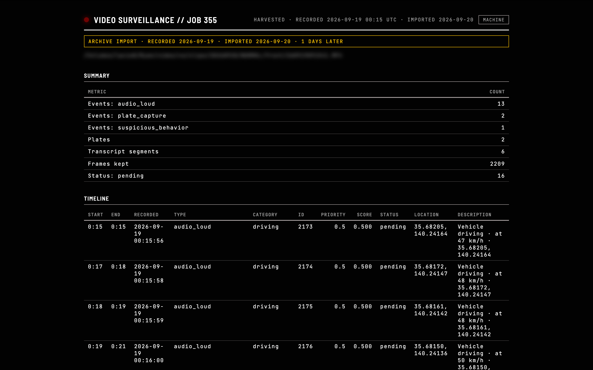
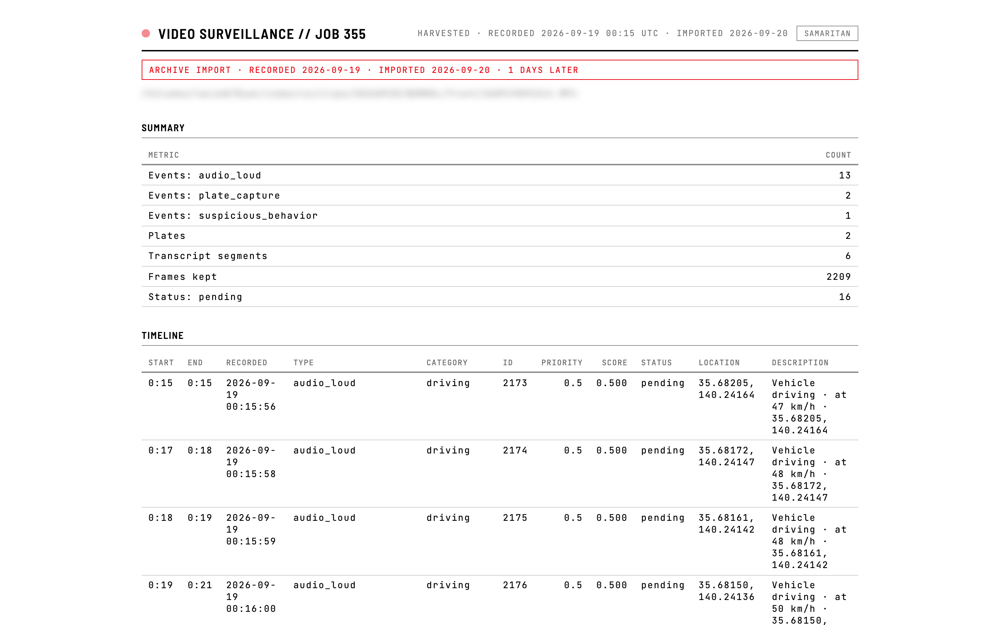
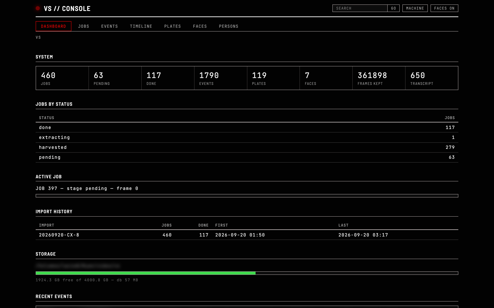
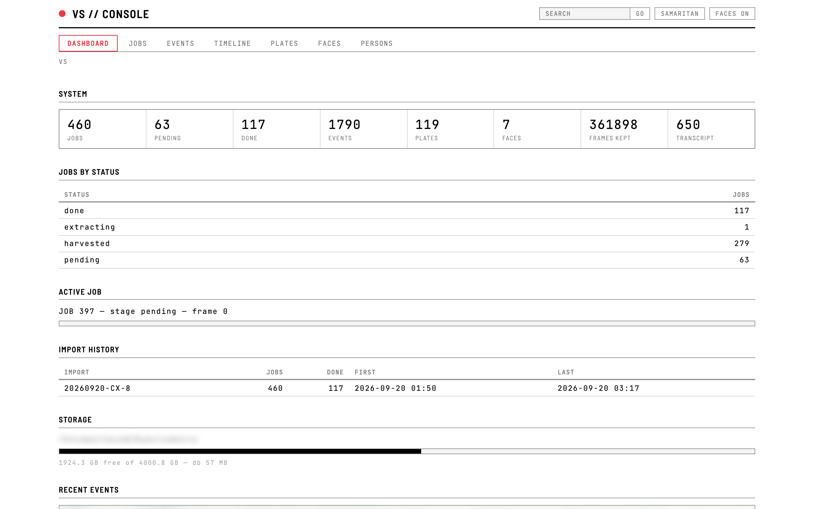
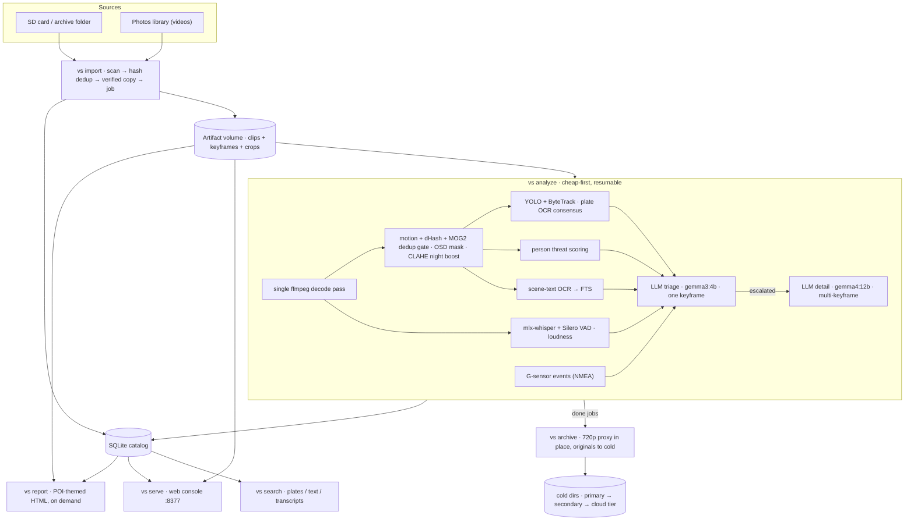

# Video Security Analyzer

A local, resumable CLI for overnight security camera / dashcam footage analysis on Apple Silicon. Cheap-first pipeline: dedup → CV prefilter → local LLM triage → detail.

## Why this exists

Ever since seeing *Person of Interest*, I always thought it would be cool to
have something like that. Then the pieces lined up: dashcam footage of my own,
the power of local compute and LLMs on Apple Silicon, and AI coding that
follows proper software engineering patterns. Mix them together, and voilà —
a nightly Machine (and Samaritan) watching my drives. The themes aren't
coincidence; they're the design language.

Its sibling, **phototext**, applies the same local-LLM approach to a photo
library.

Typhoon 2625 cleared my schedule, and this is one of the results.

## Screenshots

Reports and the web console share one design system (Person of Interest) with two themes — **Machine** (dark) and **Samaritan** (light):

| Machine | Samaritan |
|---|---|
| [](docs/images/report-full-machine.png) | [](docs/images/report-full-samaritan.png) |
| [](docs/images/web-dashboard-machine.png) | [](docs/images/web-dashboard-samaritan.png) |

Every major visual element (report sections, job tabs, lightbox, playback, map) is in [docs/screenshots.md](docs/screenshots.md).

## Install

Two ways:

**Installer (self-contained, recommended for daily use):**

```bash
./install.sh                    # installs to ~/.local/opt/video-security
./install.sh --artifact-dir /Volumes/x/vs   # configure for another output volume
```

Creates a venv snapshot at `~/.local/opt/video-security`, moves the catalog to `~/.local/opt/video-security/var/db` (existing `~/.video-security` DB is copied, original kept), writes `var/config.toml` pointing at the configured artifact dir, and puts `vs`, `vs-analyze`, `vs-import`, `vs-search`, `vs-report`, `vs-list` wrappers on `~/.local/bin` — all pre-configured. `vs-dev` runs the workspace copy instead. Re-run `install.sh` to upgrade (var/ is kept); `--uninstall [--purge]` removes.

**Manual (dev):**

Requires macOS on Apple Silicon, Python 3.12+, ffmpeg on PATH, and a local
LLM backend — either one:

- **mlx-serve** (primary) — OpenAI-compatible MLX server; set
  `[llm] provider = "mlx-serve"` with per-provider models
  (`mlx-community/gemma-4-e4b-it-4bit` triage, `gemma-4-12b-it-4bit` detail,
  `Qwen3-Embedding-0.6B-4bit-DWQ` embeddings)
- **[Ollama](https://ollama.com)** — `ollama pull gemma3:4b` and
  `ollama pull gemma4:12b`

```bash
python3.12 -m venv .venv && .venv/bin/pip install -e .
```

Python dependencies install automatically with the package: ultralytics + lap
(YOLO prefilter, ByteTrack), opencv-python, Pillow, silero-vad + mlx-whisper
(audio transcription), onnxruntime, osxphotos (Photos library import), and
pyobjc Vision/SoundAnalysis (macOS OCR for plates and scene text, loudness
detection).

## Quick Start

```bash
vs import <card-or-archive>    # Copy + dedup new clips (auto-detects Mazda CX-8)
vs archive                    # Proxy + cold-store originals of done jobs (needs [archive] cold_dirs)
vs archive --relocate A B     # Move archived cold data between locations (updates tracking)
vs repair --job 187           # Recover a corrupt/truncated clip via untrunc (optional binary)
vs archive --deep             # Later: move the proxies to cold too (evidence only on hot disk)
vs archive --delete          # Delete done-job videos outright (no proxy, no cold copy)
vs analyze <video.mp4>          # Full pipeline
vs analyze <dir>              # Batch directory
vs analyze <video> --no-llm  # Prefilter only
vs list                       # List jobs
vs report <job-id>            # HTML report
vs search "ABC123"            # Search plates/text
vs search --kind dangerous    # Filter by kind
vs config                     # Show config
```

**Web console**: `vs serve` starts a local read-only web UI at `http://127.0.0.1:8377` (loopback only, no auth, no new dependencies) — dashboard with stats/active-job progress/import history, job list with filters, embedded dynamic reports, native events browser with filmstrip + zoomable lightbox + face boxes, plate gallery grouped by plate with ken + crops, cross-job search (FTS scene text, plates, transcripts), GPS Leaflet map (CARTO tiles, `[map] carto_api_key` optional), and dual front/rear synchronized playback with an event-tick timeline. The analyzer keeps running while the console is up (WAL readers).

Typical card-swap workflow: `vs import /Volumes/CX-8`, eject card, then `vs analyze` (processes all pending jobs). Archive imports work too: `vs import /Volumes/lacie8/video/CX-8` recurses date-wrapped folders. Photos library: `vs import "~/Pictures/Photos Library.photoslibrary" --since 2026-09-01` imports videos only (phototext owns photos), copies them out so iCloud eviction can't touch them, skips cloud-only assets, and dedups by Photos UUID + content hash. Incremental — clips already imported (same content hash) are skipped.

**Reports are on demand**: `vs analyze` never writes reports — everything lands in the DB and keyframe JPEGs under `frames/<job_id>/`. When you want to review a job, run `vs report <job-id>`, which renders `reports/job_<id>.html` from the DB without re-analyzing. Find interesting jobs with `vs list` (done status) or `vs search`, then report the ones you care about.

Reports are POI-themed (Machine dark / Samaritan light toggle) with: zoomable keyframe lightbox (wheel zoom, pan, face-detection boxes), Japanese plate ken display, GPS location track (interactive Leaflet map, SVG offline fallback), reverse-geocoded place names (`[report] reverse_geocode`, default on — OSM Nominatim, cached), event categories (driving/parking/stationary), scene descriptions, recording-vs-import date flags, and cross-linked navigation (timeline → captures, plates → events, driving log → events).

### Common Flags

`--stop-after 8h` `--resume` `--watch <dir>` `--only-llm` `--max-llm-events 100` `--retention-days 30` `--retention-days 0` (no cleanup). Global: `--config <path>` `--db <path>`

## Configuration

`~/.video-security/config.toml` (see `config.example.toml`). Every threshold is configurable. Precedence: CLI > camera JSON > TOML > defaults.

SQLite DB at `~/.video-security/db`. Artifacts on external volume: `/Volumes/lacie8/video/vs` by default.

## Pipeline Overview

Single ffmpeg decode pass → motion + dHash + MOG2 dedup gate → OSD masking → CLAHE night enhancement → YOLO/ByteTrack vehicle + plate OCR consensus (Apple Vision) + person threat scoring + 30s scene-text OCR → audio: mlx-whisper + Silero VAD + RMS loudness events → NMEA G-sensor events (Mazda CX-8) → LLM triage (gemma3:4b, single keyframe) → detail (gemma4:12b, multi-keyframe + tile escalation). Reports are rendered separately on demand via `vs report`.



## Safety Rules (built-in, automatic)

- Caffeinate (sleep prevention)
- AC-power warning, disk preflight (refuses <10 GB free)
- Runtime watermark (aborts <5 GB)
- Corrupt clips: dead-letter after 3 attempts
- Stage serialization, crash-safe job leases + `--resume`

## Status

Core complete. Source adapters: `mazda_cx8` (filename timestamps, front/rear pairing, NMEA `$GPRMC`/`$GSENS` → GPS track + hard-brake/corner/impact events), `gopro`, `photos` (Apple Photos library videos via osxphotos — UUID dedup, iCloud-eviction-proof copy-at-import, device detection), `generic`. `vs import` implements scan → hash dedup → verified copy → job registration.

Mazda CX-8 G-sensor events (`hard_brake`, `hard_corner`, `impact`) are detected from NMEA sidecars at zero vision cost and flow through LLM triage/detail like visual events.

**Archive lifecycle**: `vs archive` (needs `[archive] cold_dirs` — a priority-ordered list; the first entry receives new archives, and restore tries the recorded location first, then each configured location) replaces done-job videos with a 720p H.264 proxy in place (playback keeps working, ~6x smaller) and moves the original bytes to the primary cold dir, tracked in `archived_originals` for future cloud-tiering/purge. `--dry-run` previews, `--days N`/`--job ID` select, `--restore --job ID` brings an original back. `--relocate FROM --relocate-to TO` moves archived data between cold locations and updates tracking. If you relocate cold storage behind the scenes (rename/move it without telling the tool), restore and `--deep` discover the new location by a bounded, size-verified search and self-heal the tracked paths. Evidence (keyframes, plates, faces, search, reports) is unaffected either way.

**Repair**: clips whose MP4 index was never written (truncated by card-full or
power loss — `ffprobe: moov atom not found`) are recoverable when the data
survives: `vs repair --job N` rebuilds the index with `untrunc` (build from
https://github.com/anthwlock/untrunc, put on PATH) using a healthy sibling clip
as the structural reference, writes `<name>.repaired.MP4` next to the untouched
original, and requeues the job for analysis. When untrunc is installed, the
analyze sweep and watch loop attempt this repair **automatically** on a corrupt
clip and requeue it in the same run; only unrecoverable files fall through to
mark-failed. Import rejects unprobeable files (counted as failed, no job
created), and a corrupt clip never aborts an analyze sweep.

## Development

```bash
.venv/bin/ruff check .
.venv/bin/mypy src/video_security tests
.venv/bin/pytest
.venv/bin/pytest -m benchmark
```

Package lives under `src/video_security/` (src layout).

### Smoke testing (isolated from real data)

`test-output/` is gitignored and holds the isolated smoke environment: `test-output/smoke.toml` points the DB and artifact dir at `test-output/` (never `~/.video-security/db` or the real artifact volume). Run smoke checks from the repo root:

```bash
.venv/bin/vs --config test-output/smoke.toml analyze <clip>
.venv/bin/vs --config test-output/smoke.toml report <job-id>
```

## AI-First Development

This is an AI-first project: built with [opencode](https://opencode.ai),
assisted by a professional software engineer.

## License

[AGPL-3.0-only](LICENSE) — the prefilter's `ultralytics` dependency (and its
YOLO weights) is AGPL-3.0, so the combined work is licensed accordingly.
